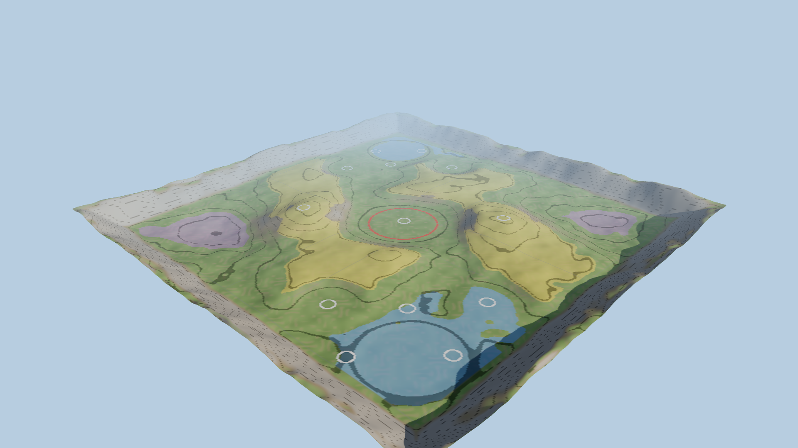

# Legend RTS – Terrain Foundation (Godot 4.4+)

Base terrain only: **no props, buildings, units, resources, trees, rocks or rivers.**

| | |
|---|---|
| Map | **428.6 m** mesh, **360 m × 360 m playable** (|x|,|z| ≤ 180), mountain rim outside |
| Scale | 1 unit = 1 m. Worker 1.2 m, soldier 1.5 m, normal building 2.4–6 m, Main Base 10 m (see `scripts/world_scale.gd`) |
| Heightmap | 513×513 float32 (0.84 m/cell), 0 – 26 m incl. rim (playable hills ≈ 8 m above the base plateau) |
| Chunks | 4×4 modular chunks (107 m, 128 cells each) |
| Factions | A base (-137, -137) · B base (+137, +137), flat plateaus ≈ 58 m wide at 5.7 m height; straight distance 388 m (~1 min walk) |
| Layout | **Identical to v1** – the design-space heightmap is rescaled uniformly (÷4.667 horizontally, ×0.257 vertically = 20 % vertical exaggeration), so all hills, valleys and routes are unchanged |
| Slopes | playable area max ≈ 23°, p95 ≈ 14° (nav agent limit 35°) |
| Corridors | 100 % of the playable area is walkable; after eroding 6 m (= 12 m wide corridors) 94 % remains and both bases stay connected |
| Resource sites | 13 positions in `terrain_meta.json → resource_sites` (3+3 beside each base, 2+2 forward pads, 3 centre/flank). Positions only - nothing is spawned. Shown as white rings in the zone view |
| Capacity | ≈ 14 000 m² flat buildable total (~7 000 m² per player); a 180-soldier block at 1.1 m spacing needs ≈ 16 × 13 m |

## Run
Open `godot/` in Godot 4.4+, press F5. WASD/edge pan, Q/E or MMB rotate, wheel zoom, **Z** toggles the zone overlay
(blue = buildable, yellow = high ground, purple = valley, white rings = resource sites).

## Layout
- `terrain_data/` – baked data: `heightmap.bin`, `heightmap16.png`, `zonemap.png` (R buildable, G high ground, B valley, A playable), `terrain_meta.json`
- `scripts/terrain/terrain_data.gd` – height/normal/slope + `is_buildable/is_high_ground/is_valley/is_playable` queries
- `scripts/terrain/terrain_manager.gd` – chunk meshes, LODs, collision, per-chunk `NavigationRegion3D`
- `shaders/terrain.gdshader` – procedural grass/dry grass/dirt/rock by slope+height (no textures needed yet)
- `scripts/camera/rts_camera.gd` – RTS camera rig, `scripts/main.gd` – sun, fog, sky
- `../tools/generate_terrain.py` – deterministic generator (`pip install numpy scipy pillow`); re-run to change the layout

## Performance design
- 3 LODs per chunk (128², 64², 32² quads) via visibility ranges (170 m / 330 m) with fade; skirts hide LOD cracks; only LOD0 casts shadows.
- Full map ≈ 16 chunks × 33 k tris at LOD0; typical RTS view draws ~3–5 chunks at LOD0/1.
- One `HeightMapShape3D` per chunk (3.3 m samples, layer 1 "terrain") – no trimesh collision.
- Depth fog + aerial perspective only (no volumetric fog), works on Forward+, Mobile and Compatibility.

## Navigation
`terrain.bake_navigation()` bakes one `NavigationMesh` tile per chunk (cell 0.25 m, agent radius 0.5 m, height 1.5 m, max slope 35°).
Project settings already match (`navigation/3d/default_cell_size=0.25`, `default_cell_height=0.25`).
Validate headless (also reports a path between the two bases):

    godot --headless --path godot --script res://scripts/terrain/bake_navigation.gd

Verified on Godot 4.4.1: 16 regions, ~8 s bake, path base A → base B = 422 m across chunk borders.
`scripts/terrain/capture_preview.gd` renders engine screenshots (needs a GL context, e.g. `xvfb-run`).

## Camera
Zoom 12 m (workers/buildings fill the screen) … 330 m (whole battlefield), default 110 m, pitch −52°, FOV 40°.
Pan speed scales with zoom; edge pan + WASD; Q/E/MMB rotate.

## Preview images
`docs/preview/` were rendered with three.js from the same heightmap/zonemap (stand-in render, not the Godot shader). `05_scale_reference_PROXIES_ONLY.png` shows grey proxy boxes/capsules (worker, soldiers, buildings, main base) purely to illustrate proportions; they are **not** part of the project.
