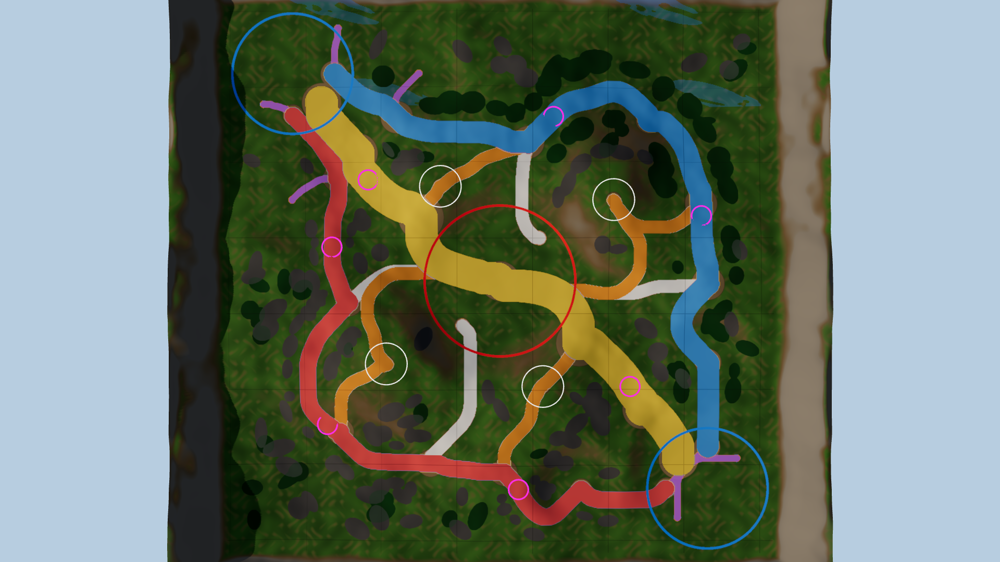

# Legend RTS – Terrain, Roads, Navigation & Resources (Godot 4.4+)

Terrain, movement structure and resource locations only: **no buildings, workers, units, heroes or UI.** Roads, forests and rock zones are *data + shader paint*, not meshes.



| | |
|---|---|
| Map | **428.6 m** mesh, **360 m × 360 m playable** (|x|,|z| ≤ 180), mountain rim outside |
| Scale | 1 unit = 1 m. Worker 1.2 m, soldier 1.5 m, normal building 2.4–6 m, Main Base 10 m (see `scripts/world_scale.gd`) |
| Heightmap | 513×513 float32 (0.84 m/cell), 0 – 26 m incl. rim (playable hills ≈ 8 m above the base plateau) |
| Chunks | 4×4 modular chunks (107 m, 128 cells each) |
| Factions | A base (-137, -137) · B base (+137, +137), flat plateaus ≈ 58 m wide at 5.7 m height; straight distance 388 m (~1 min walk) |
| Layout | **Identical to v1** – the design-space heightmap is rescaled uniformly (÷4.667 horizontally, ×0.257 vertically = 20 % vertical exaggeration), so all hills, valleys and routes are unchanged |
| Slopes | playable area max ≈ 23°, p95 ≈ 14° (nav agent limit 35°) |
| Corridors | 100 % of the playable area is walkable; after eroding 6 m (= 12 m wide corridors) 94 % remains and both bases stay connected |
| Resource sites | 13 positions in `terrain_meta.json → resource_sites` (3+3 beside each base, 2+2 forward pads, 3 centre/flank). Positions only - nothing is spawned. Shown as white rings in the zone view |
| Capacity | ≈ 14 000 m² flat buildable total (~7 000 m² per player); a 180-soldier block at 1.1 m spacing needs ≈ 16 × 13 m |

## Movement structure (v3)
Player-1 view: base A is north-west, base B south-east. *Left* = north-east route, *right* = south-west route.

| Route | Width | Length A→B | Character |
|---|---|---|---|
| **Centre lane** (yellow) | 22 m (≥ 29 m free) | 370 m | widest, most direct, passes through the open central arena (r = 50 m, 100 % free) |
| **Left lane** (blue) | 15 m (≥ 20 m free) | 488 m | sheltered valley, forests on both flanks - flanking route; 2 chokes (≥ 20 m wide) |
| **Right lane** (red) | 12 m (≥ 17 m free) | 494 m | narrow, winding rocky uplands - ambush / surprise route; 3 chokes (≥ 17 m wide) |
| Links (white) | 9 m | | 4 connectors lane → arena entrances (N, E, S, W) = extra attack routes |
| Ramps (orange) | 9 m, ≤ 14° | | every summit (4) reached from two different roads, rock ring with natural gaps |
| Worker paths (purple) | 5 m | | base exits → resource sites / forward pads |

- 52 road edges / 41 nodes in `terrain_data/paths.json`; the road graph has **no critical bridge** - every junction, summit and base exit has ≥ 2 edge-disjoint routes.
- Each base has 3 exits (centre / left / right) on a 40 m radius open apron (no blockers); the Main Base footprint in the middle stays free.
- Roads follow the existing terrain (A* on slope cost, smoothed); **terrain heights were not modified**. Road gradient ≤ 10.5° (ramps ≤ 14°), nav limit 18°.
- 186 natural blockers (72 forest, 114 rock; ≈ 14 % of the playable area) are *convex polygons carved out of the navmesh* (`blockers.json`) and painted by the shader - no meshes. Gaps every few clumps keep alternatives open; no wall is longer than a few clumps.
- Navigation: 16 `NavigationRegion3D` tiles; slope ≤ 18° walkable, forests/rocks/rim carved out. Baked tiles are stored in `terrain_data/nav/` (124 KB) and loaded at start (~1.3 s for the whole map incl. terrain); if missing they are baked at runtime.
- `TerrainData` queries: `is_on_road`, `lane_at`, `is_blocked`, `is_walkable`, `is_buildable` (flat, not a road, not blocked). `PathNetwork` (`terrain.get_path_network()`): nodes, edges, lane curves, chokes, strategic `route()`.

Regenerate: `python3 tools/generate_terrain.py && python3 tools/generate_paths.py` (needs numpy scipy pillow scikit-image networkx); validate in Godot with `scripts/terrain/bake_navigation.gd` (see below). `tools/debug_paths.py out.png` draws the network.

## Resource system (v4)
22 resource locations (`terrain_data/resources.json`, scenes in `scenes/resources/`, shared meshes in `resources/`), placed on the existing terrain / roads.

| Tier | Per player | Neutral | Content |
|---|---|---|---|
| **Safe** (40-75 m from the base, behind the lanes) | 2 Gold (7 500 each), 1 Wood zone (≈ 5 400), 1 Stone (6 000) | - | gold 40-48 m, wood 41 m, stone 75 m |
| **Side / expansion** (90-122 m) | 1 Gold (5 000, slow regen), 1 Wood zone (7 200, regrows) | - | forward pads next to the left / right lane |
| **Flank** | - | 2 Stone (5 000) | NE / SW valleys, equally far from both bases (245 / 271 m) |
| **Central contest** (arena + hills) | - | 2 high-value Gold (14 000, 2.8/s), 2 Crystal (2 500, rare), 2 Wood, 2 Stone | exposed, next to the arena entrances |

**Fairness:** every player location has an *exact point mirror* for the other player (same type, size, amount, tree layout) - distance to the own base is identical (0.0 m mismatch); measured on the navmesh the worst P1/P2 walking distance ratio is 1.045. Central pairs mirror too (summed distance to base A = base B = 2 106 m). Totals per player: 20 000 gold, 12 600 wood, 6 000 stone.

**Space:** deposit footprint + a worker slot ring (gold 8 slots @ 7.4 m, stone 8 @ 8.6 m, crystal 4 @ 6.2 m, wood 8-12 slots around the grove) + turn-around room; slots are ≥ 5 m apart, the base-facing 80° approach wedge is free of obstacles, the solid footprint is carved out of the navmesh and every slot is verified reachable. 16 of the 186 decorative Prompt-2 forest/rock blockers that overlapped a work area were removed (listed in `resources.json → removed_blockers`); roads, lanes and terrain are untouched.

**Scene structure** (generated by `tools/generate_resources.py`, no scripts attached yet):
```
ResourceNode (StaticBody3D, layer 4 "resources", group resource_nodes, metadata = future variables)
├── CollisionShape3D        simple cylinder
├── Mesh / MeshLOD          LOD0 < 150 m, LOD1 beyond (fade)
├── GatheringPoint          Marker3D: slot nearest to the drop-off base
├── WorkerInteractionArea   Area3D (mask = units)
├── NavigationAccess        Marker3D Slot_0..n + Approach
└── ResourceVisual          Glow (Sprite3D) / Trees_* MultiMeshInstance3D for wood
```
Metadata on every node: `resource_type, resource_amount, gather_rate, gather_range, respawn_time, max_workers` (+ `tier, owner, carry_capacity, regen_rule, regen_rate, regen_delay, dropoff_base, strategic_value, location_id`). Regeneration is data only: gold `limited` (safe) / `slow` (side, centre), wood `regrow` (per tree, 90-120 s), stone `limited`, crystal `none`.

**Performance:** gold deposit 512 tris (LOD 140), stone quarry 540 (140), crystal 242 (68), trees 33 / 132 / 52 tris (LOD 10 / 28 / 28). All meshes are flat-shaded vertex-colour geometry (1 material per family, no textures); the 162 trees live in 6 `MultiMesh`es per grove (3 species x 2 LODs); ground paint under work areas is one extra texture lookup. `ResourceDatabase` (`scripts/resources/`) exposes the data to code. Re-build meshes: `godot --headless --path godot --script res://scripts/tools/build_resource_assets.gd`.

## Run
Open `godot/` in Godot 4.4+, press F5. WASD/edge pan, Q/E or MMB rotate, wheel zoom, **Z** toggles the zone overlay
(blue = buildable, yellow = high ground, purple = valley), **P** toggles the lane debug view (roads coloured by lane, chokes magenta). Pipeline: `generate_terrain.py` → `generate_paths.py` → `generate_resources.py` (+ `bake_navigation.gd`).

## Layout
- `terrain_data/` – baked data: `heightmap.bin`, `heightmap16.png`, `zonemap.png` (R buildable, G high ground, B valley, A playable), `terrain_meta.json`
- `scripts/terrain/terrain_data.gd` – height/normal/slope + `is_buildable/is_high_ground/is_valley/is_playable` queries
- `scripts/terrain/terrain_manager.gd` – chunk meshes, LODs, collision, per-chunk `NavigationRegion3D`
- `shaders/terrain.gdshader` – procedural grass/dry grass/dirt/rock by slope+height (no textures needed yet)
- `scripts/camera/rts_camera.gd` – RTS camera rig, `scripts/main.gd` – sun, fog, sky
- `../tools/generate_terrain.py` – deterministic generator (`pip install numpy scipy pillow`); re-run to change the layout

## Performance design
- 3 LODs per chunk (128², 64², 32² quads) via visibility ranges (170 m / 330 m) with fade; skirts hide LOD cracks; only LOD0 casts shadows.
- Full map ≈ 16 chunks × 33 k tris at LOD0; typical RTS view draws ~3–5 chunks at LOD0/1.
- One `HeightMapShape3D` per chunk (3.3 m samples, layer 1 "terrain") – no trimesh collision.
- Depth fog + aerial perspective only (no volumetric fog), works on Forward+, Mobile and Compatibility.

## Navigation
`terrain.bake_navigation()` bakes one `NavigationMesh` tile per chunk (cell 0.25 m, agent radius 0.5 m, height 1.5 m, max slope 35°).
Project settings already match (`navigation/3d/default_cell_size=0.25`, `default_cell_height=0.25`).
Bake + validate headless (stores tiles, checks every road edge, lanes, carved blockers, open arena/aprons, rim):

    godot --headless --path godot --script res://scripts/terrain/bake_navigation.gd

Verified on Godot 4.4.1 (`NAVIGATION CHECKS PASSED`): 16 regions, 5 k polygons, 87.9 % of the playable area navigable, all 948 road samples on the navmesh, 0/186 blocker centres navigable, 0/200 rim samples navigable, base A → base B = 438 m (centre lane).
`scripts/terrain/capture_preview.gd` renders engine screenshots (needs a GL context, e.g. `xvfb-run`).

## Camera
Zoom 12 m (workers/buildings fill the screen) … 330 m (whole battlefield), default 110 m, pitch −52°, FOV 40°.
Pan speed scales with zoom; edge pan + WASD; Q/E/MMB rotate.

## Preview images
`docs/preview/` were rendered with three.js from the same heightmap/road/block maps (stand-in render, not the Godot shader; the Godot shader was verified separately with `capture_preview.gd`). `05_scale_reference_PROXIES_ONLY.png` (from the previous step) shows grey proxy boxes/capsules (worker, soldiers, buildings, main base) purely to illustrate proportions; they are **not** part of the project.
