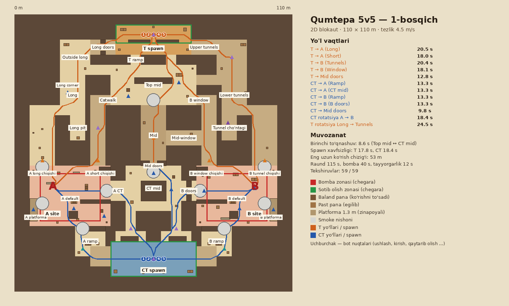

# Qumtepa 5v5

Qumtepa v2 (2v2, 50×50 m) asosida 5v5 uchun yangi xarita: **110×110 m**, 55×55 katak (har biri 2 m).
Godot 4.3, bomba rejimi (T hujum qiladi, CT himoya qiladi).



## Bosqichlar

| # | Bosqich | Holat |
|---|---|---|
| 0 | Konsepsiya: yo'llar sxemasi, vaqt maqsadlari | ✅ |
| 1 | 2D blokaut: yakuniy reja, panalar, ko'rish chiziqlari, smoke rejasi, callout'lar | ✅ ([hisobot](docs/STAGE1.md)) |
| 2 | Godot greybox: qutilardan 3D, collision, NavMesh, spawn, zonalar, raund, testlar | ✅ ([hisobot](docs/STAGE2.md)) |
| 3 | Balans sinovi: smoke lineup'lari, 5v5 botlar (1080 raund), tuzatishlar | ✅ ([hisobot](docs/STAGE3.md)) |
| 4 | Arxitektura: binolar, arkalar, derazalar, tomlar, hudud uslublari | ⏳ |
| 5 | Props va teksturalar, sirt turlari | — |
| 6 | Yorug'lik, osmon, atmosfera, tovush zonalari | — |
| 7 | Optimallashtirish (occlusion, LOD, MultiMesh), minimap, yakuniy testlar | — |

## O'ynash

Godot 4.3 → Import → `qumtepa-5v5/godot/project.godot` → F5 (o'zingiz o'ynaysiz). `bots.tscn` → F6 — 5v5 bot o'yinini kuzatish. Boshqaruv: [STAGE2.md](docs/STAGE2.md), [STAGE3.md](docs/STAGE3.md).

## Tuzilma

```
qumtepa-5v5/
├── tools/
│   ├── layout5.py      # xarita rejasi: kataklar, zonalar, panalar, spawn, bomba/sotib olish zonalari,
│   │                   # raund qoidalari, smoke rejasi, bot nuqtalari, vaqt maqsadlari (YAGONA MANBA)
│   ├── analyze5.py     # 2D tahlil va 59 ta tekshiruv, chizmalar
│   ├── build5.py       # greybox 3D model (GLB) + to'qnashuv ma'lumotlari
│   ├── gen_godot5.py   # Godot loyihasini yaratadi (sahna, collision, map_data, test ma'lumotlari)
│   ├── make_all.sh     # hammasi ketma-ket + NavMesh + 79 ta Godot testi
│   └── godot_src/      # Godot testlari va skrinshot skripti (manba)
├── godot/              # tayyor Godot 4.3 loyihasi (avtomatik yaratilgan)
└── docs/               # hisobotlar, chizmalar, skrinshotlar, tahlil JSON
```

O'yin skriptlari (o'yinchi, raund, HUD, bomba) va tovushlar `qumtepa-v2/` dan olinadi.

## Qayta yaratish

```
pip install numpy scipy pillow trimesh
cd qumtepa-5v5/tools
GODOT=/yo'l/godot4 ./make_all.sh     # natija: "Tekshiruvlar: 59 / 59" va "NATIJA: 79 / 79"
```

Xaritani o'zgartirish: faqat `layout5.py` ni tahrirlang va `make_all.sh` ni ishga tushiring.
