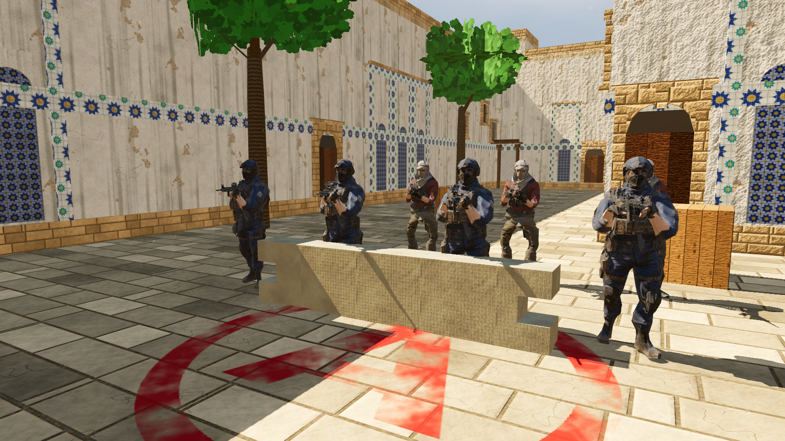
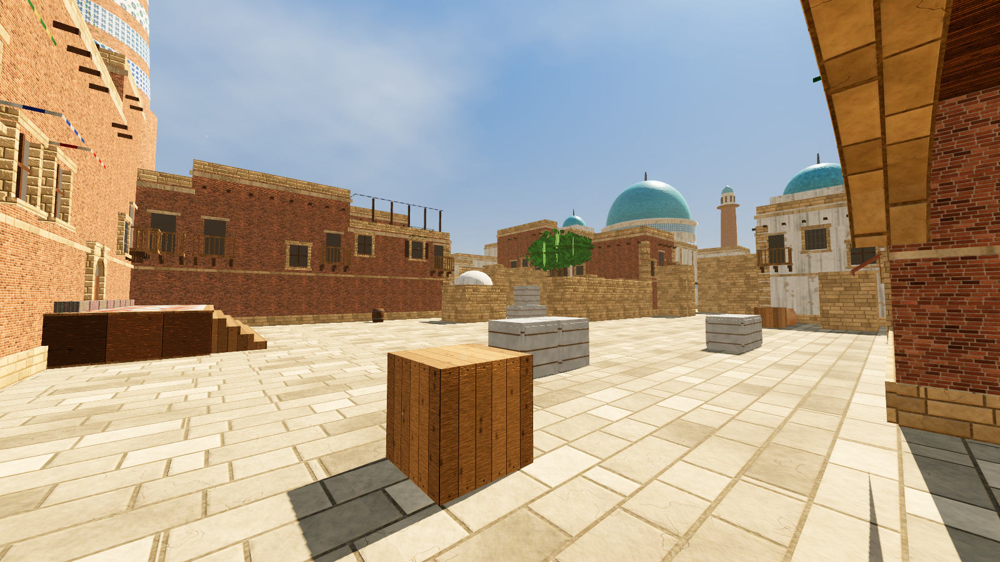
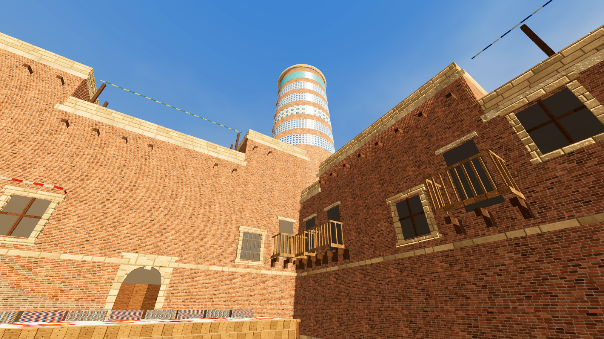

# Qumtepa 5v5

**Loyiha yakunlandi — [yakuniy hisobot](docs/YAKUNIY_HISOBOT.md).**

Qumtepa v2 (2v2, 50×50 m) asosida 5v5 uchun yangi xarita: **110×110 m**, 55×55 katak (har biri 2 m).
Godot 4.3, bomba rejimi (T hujum qiladi, CT himoya qiladi).








## Bosqichlar

| # | Bosqich | Holat |
|---|---|---|
| 0 | Konsepsiya: yo'llar sxemasi, vaqt maqsadlari | ✅ |
| 1 | 2D blokaut: yakuniy reja, panalar, ko'rish chiziqlari, smoke rejasi, callout'lar | ✅ ([hisobot](docs/STAGE1.md)) |
| 2 | Godot greybox: qutilardan 3D, collision, NavMesh, spawn, zonalar, raund, testlar | ✅ ([hisobot](docs/STAGE2.md)) |
| 3 | Balans sinovi: smoke lineup'lari, 5v5 botlar (1080 raund), tuzatishlar | ✅ ([hisobot](docs/STAGE3.md)) |
| 4 | Arxitektura: 5 hudud uslubi (qal'a, bozor, madrasa, karvonsaroy, masjid), mo'ljal binolari | ✅ ([hisobot](docs/STAGE4.md)) |
| 5 | Milliy buyumlar va teksturalar: girih, majolika, ganch, ayvon, vassa, atlas, so'zana, tandir, so'ri, paxta, chinor, Kalta Minor | ✅ ([hisobot](docs/STAGE5.md)) |
| 6 | Yorug'lik (adolatli quyosh, qorong'i burchaksiz), shom rejimi, 6 xil fon tovushi, aks-sado | ✅ ([hisobot](docs/STAGE6.md)) |
| 7 | Optimallashtirish (bo'laklar, occlusion, masofada yashirish: −69% chizish), minimap, F9, yakuniy tekshiruv | ✅ ([hisobot](docs/STAGE7.md)) |
| 8 | Yakuniy audit (tirqish/teshik/tiqilish yo'q), PBR teksturalar va realistik yorug'lik, T/CT personajlari: skelet, 21 animatsiya, AKM/M416, Shift/o'tirish/sakrash, o'ziga 1-shaxs, boshqalarga 3-shaxs | ✅ ([hisobot](docs/STAGE8.md)) |

## O'ynash

Godot 4.3 → Import → `qumtepa-5v5/godot/project.godot` → F5 (o'zingiz o'ynaysiz; Shift — sekin yurish, Ctrl/C — o'tirish, sichqoncha — o'q, R — qayta o'qlash, M — xarita, F4 — shom, F9 — FPS). `bots.tscn` → F6 — 5v5 bot o'yinini kuzatish. Boshqaruv: [STAGE2.md](docs/STAGE2.md), [STAGE3.md](docs/STAGE3.md).

## Tuzilma

```
qumtepa-5v5/
├── tools/
│   ├── layout5.py      # xarita rejasi: kataklar, zonalar, panalar, spawn, bomba/sotib olish zonalari,
│   │                   # raund qoidalari, smoke rejasi, bot nuqtalari, vaqt maqsadlari (YAGONA MANBA)
│   ├── analyze5.py     # 2D tahlil va 59 ta tekshiruv, chizmalar
│   ├── build5.py       # 3D model: STYLE=greybox yoki STYLE=arch (to'qnashuv ikkalasida bir xil)
│   ├── arch5.py        # 4-bosqich: hudud uslublari, facade bezaklari, mo'ljal binolari
│   ├── textures5.py    # protsedural teksturalar (v2 + koshin, girih, majolika, ganch, atlas, so'zana ...)
│   ├── audio5.py       # 6-bosqich: hududlarning fon tovushlari
│   ├── check_shots.py  # 6-bosqich: skrinshotlardan ko'rinish (yorqinlik) tekshiruvi
│   ├── minimap5.py     # 7-bosqich: minimap rasmi
│   ├── textures_hq.py  # 8-bosqich: 1024 px PBR teksturalar (rang/normal/ORM/relyef), osmon, decal'lar
│   ├── rig_characters.py # 8-bosqich: T/CT skelet, og'irliklar, IK bilan qurol ushlash, 21 animatsiya (Blender bpy)
│   ├── gen_godot5.py   # Godot loyihasini yaratadi (sahna, collision, map_data, test ma'lumotlari)
│   ├── make_all.sh     # hammasi ketma-ket + NavMesh + 116 Godot testi + audit
│   └── godot_src/      # Godot testlari va skrinshot skripti (manba)
├── assets_src/         # siz bergan Meshy modellari (T, CT, AKM, M416) — rig_characters.py manbasi
├── godot/              # tayyor Godot 4.3 loyihasi (avtomatik yaratilgan; characters/ — skeletli personajlar)
└── docs/               # hisobotlar, chizmalar, skrinshotlar, tahlil JSON
```

O'yin skriptlari (raund, HUD, bomba) va qadam tovushlari `qumtepa-v2/` dan olinadi; o'yinchi, personajlar, birinchi shaxs — `tools/godot_src/scripts/`.

## Qayta yaratish

```
pip install numpy scipy pillow trimesh     # personajlar uchun: pip install bpy==4.2.0
cd qumtepa-5v5/tools
GODOT=/yo'l/godot4 ./make_all.sh     # 2D 59/59, Godot 116/116, smoke 10/10, audit 6/6
RIG=1 GODOT=... ./make_all.sh        # + personajlarni qaytadan yaratish
SHOTS=1 BOTS=360 GODOT=... ./make_all.sh   # + skrinshotlar va ko'rinish tekshiruvi, + 5v5 bot o'yinlari
```

Xaritani o'zgartirish: faqat `layout5.py` ni tahrirlang va `make_all.sh` ni ishga tushiring.
