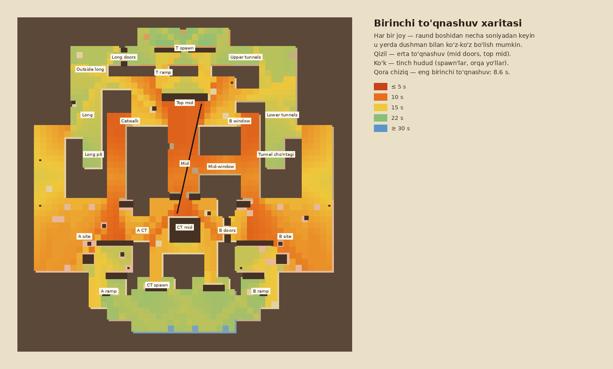

# 1-bosqich: 2D blokaut — hisobot

> 2-bosqichda T spawn devori surildi (ramp oldidagi o'tish 1.5 m dan 4.5 m ga), B default A default ning ko'zgu nusxasi qilindi. Raqamlar shu o'zgarishlardan keyingi holat.

**Natija: 59 / 59 tekshiruv o'tdi.** Reja `tools/layout5.py` da, tahlil `tools/analyze5.py` da.

Hamma o'lchovlar yugurish tezligi 4.5 m/s, o'yinchi radiusi 0.35 m bilan hisoblangan. Panalar va devorlar
hisobga olingan, yo'llar 0.25 m to'rda. Ko'rish chiziqlari ko'z darajasida (1.7 m) tekshirildi:
devorlar va 2 qavatli qutilar ko'rishni to'sadi, bitta quti, qop va bochka to'smaydi (ular ustidan otish mumkin).

## Xarita tuzilishi

T shimolda, CT janubda. Ikki site bir-biriga ko'zgudek, lekin xarakteri har xil:

| | A tomoni | B tomoni |
|---|---|---|
| Uzun yo'l | **Long**: ochiq, keng, snayper uchun. 90° burilishli (Long corner), yonida **Long pit** yashirinish joyi | **Tunnels**: yopiq (tomli), tor, yaqin jang. 90° burilishli, yonida **Tunnel cho'ntagi** |
| Qisqa yo'l | **Catwalk** (Top mid dan) | **B window** (Top mid dan) + qo'shimcha **Mid-window** yo'lagi (Mid dan) |
| Site | Kam, lekin katta panalar; **A quduq**, **A xarobasi** | Zich, ko'p kichik panalar; **B quduq**, **B xarobasi** |
| CT yo'llari | **A ramp** (spawn dan), **A CT** (CT mid dan) | **B ramp** (spawn dan), **B doors** (CT mid dan) |
| Platforma | **A platforma** 1.3 m | **B platforma** 1.3 m |

Markaz: **T ramp** (2 ta) → **Top mid** (markazida xaroba) → **Mid** (yopiq) → **Mid doors** (3 m eshik) →
**CT mid** (o'rtasida bino, atrofi halqa) → 2 ta yo'lak → **CT spawn**.

## Vaqtlar

| Yo'l | Vaqt | Maqsad |
|---|---|---|
| T → A (Long) | 20.5 s | 16–20.5 s |
| T → A (Short / Catwalk) | 18.0 s | 16–20.5 s |
| T → B (Tunnels) | 20.3 s | 16–20.5 s |
| T → B (Window) | 18.1 s | 16–20.5 s |
| CT → A (Ramp / A CT) | 13.3 / 13.3 s | 10–13.5 s |
| CT → B (Ramp / B doors) | 13.3 / 13.3 s | 10–13.5 s |
| Mid doors: T / CT | 12.8 / 9.8 s | CT 1.5–3 s oldin |
| CT rotatsiya A → B | 18.4 s | T rotatsiyasidan tez |
| T rotatsiya Long → Tunnels | 24.5 s | |

**Muvozanat:**
- **A va B teng.** T uchun eng tez yo'l: A ga 18.0 s, B ga 18.1 s. CT uchun ikkalasi 13.3 s.
- **T ning 4 ta hujum yo'li orasidagi farq 2.5 s.** Qisqa yo'llar tezroq, lekin tor. Uzun yo'llar sekinroq, lekin keng.
- **CT site'ga 4.7 s oldin yetadi.** Bu himoyaga joylashish uchun vaqt.
- **Qaytarib olish mumkin.** Bomba 40 s: CT rotatsiyasi 18.4 s + zararsizlantirish 10 s, yana 11.6 s zaxira qoladi.
- **5 ta spawn joyi teng.** Eng yaqin chiqishgacha farq T da 0.42 s, CT da 0.37 s.

## Ko'rish chiziqlari va to'qnashuvlar

- **Birinchi to'qnashuv 8.6 s da**, Top mid ↔ CT mid, Mid doors eshigi orqali. Bu rejalashtirilgan
  snayper dueli, "Mid doors" smoke'i bilan yopiladi. Boshqa hamma joyda to'qnashuv kechroq.
- **Spawn xavfsizligi.** T spawn'ni dushman eng erta 17.8 s da, CT spawn'ni 18.4 s da ko'ra oladi.
  Maqsad ≥ 15 s edi: spawn'dan chiqayotganda o'q uzib bo'lmaydi.
- **Eng uzun talashuvli ko'rish chizig'i 53 m** (Long chiqishi → A CT → CT mid). Maqsad ≤ 60 m edi.
  Bir jamoa hududining ichidagi chiziqlar hisobga olinmaydi (masalan, T ning orqa yo'laklari).

## Tahlil topgan va tuzatilgan muammolar

Qoralamada ko'p kamchilik bor edi. Tahlil ularni topdi, reja qayta ishlandi:

1. **T spawn → CT mid to'g'ri chiziq (60 m).** Birinchi to'qnashuv 5.5 s da bo'lardi, spawn'lar bir-birini
   ko'rardi. Yechim: T ramp 2 ga bo'lindi va chetga surildi, Top mid'ga xaroba, CT mid'ga bino qo'yildi,
   ikkala spawn'ga ko'rishni to'suvchi devorlar qo'shildi.
2. **A CT ↔ B doors gorizontal chizig'i (97 m)** butun xaritani kesib o'tardi. CT mid binosi uni kesdi.
3. **Long va Tunnels to'g'ri edi (75 m).** Endi 90° burchak bilan buriladi, pit va cho'ntak paydo bo'ldi.
4. **Catwalk → A site → A ramp chizig'i.** Birinchi to'qnashuv 6.2 s edi. Yechim: A ramp siljitildi,
   ramp tepasiga devor, A xarobasi, short chiqishiga devor qo'yildi. B tomonida ham xuddi shunday.
5. **T uchun A 3 s tezroq edi.** B window endi Catwalk'ning ko'zgu nusxasi, Mid-window esa qo'shimcha yo'l.

## Smoke rejasi (10 ta)

Hammasi tekshirildi: nishon ochiq osmon ostida, otish masofasi ≤ 45 m, otish joyiga yetib boriladi,
smoke kerakli ko'rish chiziqlarini to'sadi.

| Smoke | Jamoa | Qayerdan | Masofa | Nimani yopadi |
|---|---|---|---|---|
| A CT | T | Long | 38 m | A CT dan plant'ga qarash |
| A ramp | T | Catwalk | 40 m | Ramp'dan site'ga qarash |
| A platforma | T | Long | 25 m | Platformadan long chiqishiga |
| B doors | T | Mid-window | 20 m | B doors dan plant'ga |
| B ramp | T | B window | 40 m | Ramp'dan site'ga |
| B platforma | T | Lower tunnels | 25 m | Platformadan tunnel chiqishiga |
| Mid doors | T | Top mid | 40 m | Mid doors snayper chizig'i |
| Long chiqishi | CT | A ramp | 36 m | Long'dan site'ga chiqish |
| Tunnel chiqishi | CT | B ramp | 36 m | Tunnels'dan site'ga chiqish |
| Top mid | CT | Mid doors | 29 m | Top mid'dan mid'ga qarash |

Aniq otish nuqtalari (qayerga qarab otish kerakligi) 3-bosqichda, fizika bilan tekshiriladi.

## Raund qoidalari (110 m xarita uchun)

Tayyorgarlik 12 s · sotib olish 25 s · raund 1:55 · bomba 40 s · o'rnatish 3 s ·
zararsizlantirish 10 s (kit bilan 5 s) · g'alaba 13 raund.
Qumtepa v2 da raund 1:25, bomba 35 s, zararsizlantirish 7 s edi.

## Boshqa ma'lumotlar

- **Callout'lar:** 32 ta nom, har bir yuriladigan katakda bor (`analysis_stage1.json` → `callout_grid`).
- **Bot nuqtalari:** 34 ta (plant, ushlash, kirish, qaytarib olish, yashirinish, aylanish). Hammasiga yetib boriladi.
- **Panalar:** 88 ta obyekt: qutilar, bochkalar, qoplar, xarobalar, quduqlar, 2 ta platforma.

## Cheklovlar (2-bosqichda aniqlanadi)

- **Tahlil 2D.** Platformalar va zinapoyalar balandligi hisobga olinmagan, 1.3 m platformadan ko'rish biroz boshqacha bo'ladi.
- **Vaqtlar 3D fizikada ±5% farq qilishi mumkin.** Qumtepa v2 da ham shunday bo'lgan. 2-bosqichdagi Godot testlari haqiqiy vaqtni o'lchaydi.
- **Granata trayektoriyalari hali tekshirilmagan.** 3-bosqichda Godot fizikasi bilan tekshiriladi.
