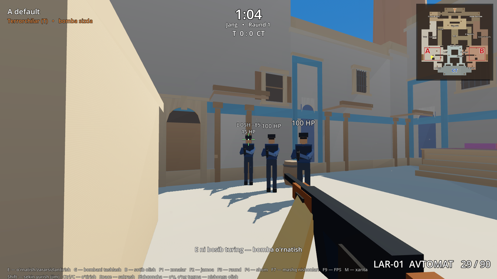
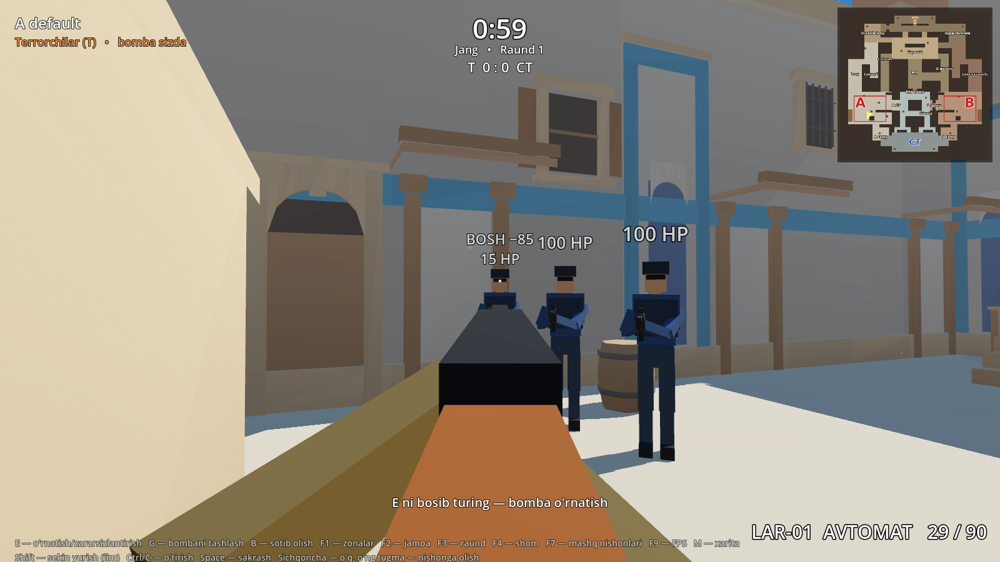

# 10-bosqich: qurol tizimi (Legend Tactical FPS'dan olinganlar)

Foydalanuvchi bergan `LEGEND_TACTICOOL_FPS_DAY20` loyihasidan **faqat hozir keraklilari** olindi va Qumtepa'ga moslab qayta yozildi.
U yerdagi kod to'g'ridan-to'g'ri ko'chirilmadi. Sabablari: u Godot 4.7.2 uchun yozilgan, to'qnashuv qatlamlari boshqacha, ichida kompilyatsiya xatosi bor.

Tekshiruvlar: Godot **129/129** (yangi 20-bo'lim: 13 ta), smoke **10/10**, audit **6/6**, 5v5 botlar ishlaydi.

## Olinganlar

| Legend Tactical FPS'da | Qumtepa'da | Fayl |
|---|---|---|
| `LegendWeaponData` (qurol ma'lumotlari resursi) | soddalashtirilgan `weapon_data.gd` + 3 ta `.tres` (LAR-01, Apex-9, pichoq — ularning raqamlari bilan) | `scripts/weapon_data.gd`, `weapons/*.tres` |
| tepki naqshi, tarqalish, ADS, o'q rejimlari, qayta o'qlash (`weapon.gd`, `fire_controller.gd`) | shu imkoniyatlar mavjud 1-shaxs ko'rinishiga qo'shildi | `scripts/fp_view.gd` |
| `LegendHitZone` (bosh/tana/qo'l/oyoq ko'paytuvchilari), hitbox | manekin suyaklariga bog'langan o'q zonalari (10-qatlam), qurol ma'lumotidagi ko'paytuvchilar | `scripts/character_model.gd` |
| `CombatHUD` (nishon belgisi, tegish belgisi) | tarqalishga mos nishon belgisi; tegish belgisi (boshga — qizil) | `scripts/combat_hud.gd` |
| `TrainingTarget` | F7 — mashq nishonlari (100 HP, zarar va zona yozuvi, 2.5 s da tiriladi) | `scripts/practice.gd` |

## Boshqaruv

| Tugma | Vazifa |
|---|---|
| 1 / 2 / 3, g'ildirak | avtomat LAR-01 / to'pponcha Apex-9 / pichoq |
| Chap tugma | o'q (avtomat — bosib turish, 3 talik, bittalik) |
| O'ng tugma | nishonga olish (ADS): FOV ×0.77, tarqalish ×0.35, sezgirlik ×0.65 |
| B | o'q rejimi |
| R | qayta o'qlash (2.2 s; magazin bo'sh bo'lsa 2.85 s) |
| F7 | mashq nishonlari |

## Zarar (LAR-01)

Bosh 85 (×2.5), tana 34, qo'l 28.9 (×0.85), oyoq 28.9 (×0.85). 55 m dan uzoqda ×0.65.
To'pponcha: tana 26, bosh 62. Pichoq: 2.4 m gacha, 75.

## Olinmaganlar (keyin kerak bo'lsa olinadi)

- **Boshqa qurollar:** SMG, snayper, drobovik — sotib olish menyusi qilinganda.
- **HE granata va jihozlar menejeri:** granata kerak bo'lganda. Ularning `grenade_projectile.gd` faylida xato bor: 177-qatorda `Tween.TRANS_OUT_QUAD` Godot'da yo'q, to'g'risi `TRANS_QUAD` + `EASE_OUT`.
- **Telefon boshqaruvi va sifat rejimlari:** Android versiyasida.
- **Ularning o'yinchi kontrolleri, Bootstrap, GameManager va boshqa menejerlar:** bizda o'z tizimi bor va testlangan.

## Hozircha o'zgarmaganlar

- **Botlar:** o'z otish modeli bilan otadi (balans 1080 raundda sinalgan). Endi o'yinchi o'qi botlarga ham tana zonasi bo'yicha zarar beradi (`bot.take_hit`).
- **Yurish tezligi:** qurolga qarab o'zgarmaydi. Yurish vaqtlari 4.5 m/s ga hisoblangan va testlangan.
