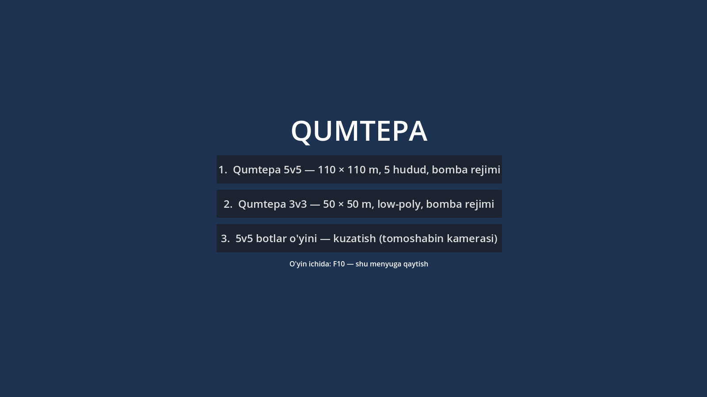
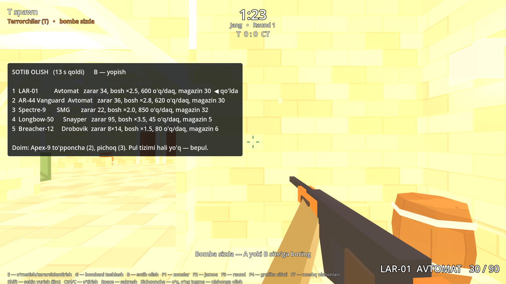
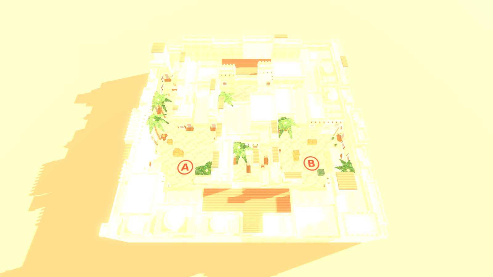
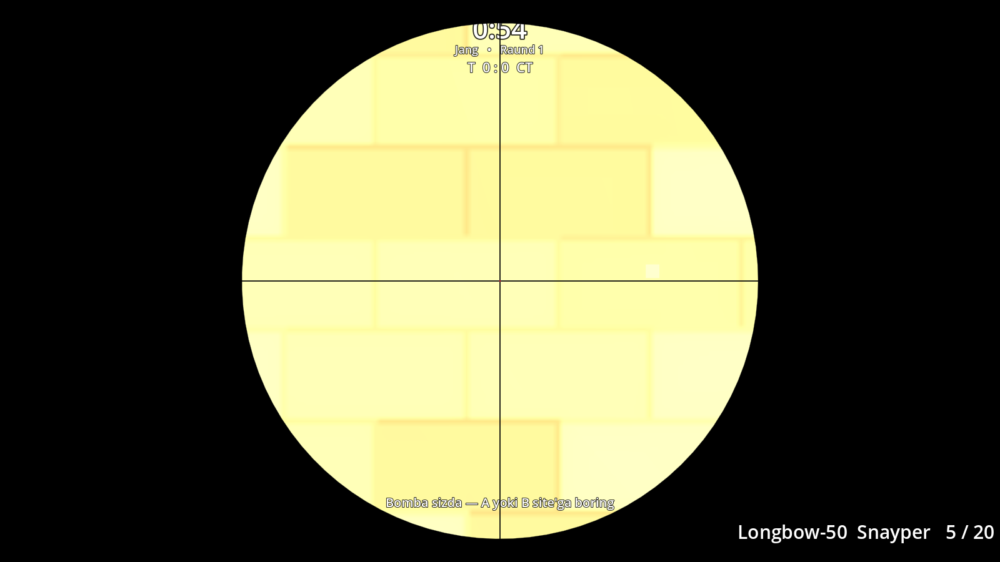

# 11-bosqich: qolgan qurollar, sotib olish menyusi, 3v3 xaritasi, bosh menyu

Tekshiruvlar: 5v5 Godot **133/133**, 3v3 xaritaning o'z testlari **52/52**, 3v3 audit **0 muammo**, smoke **10/10**, 5v5 audit **6/6**.
Eski fayllar (qahramonlar, animatsiyalar, AKM/M416) o'chirilmadi.

## 1. Qurollar — Legend Tactical FPS konfiguratsiyasi bo'yicha

| # | Qurol | Turi | Zarar (tana / bosh) | O'q/daq | Magazin / zaxira | Qayta o'qlash | Masofa (to'liq zarar, keyin) | Alohida |
|---|---|---|---|---|---|---|---|---|
| 1 | LAR-01 | avtomat | 34 / 85 | 600 | 30 / 90 | 2.2 s | 55 m, ×0.65 | avtomat / 3 talik / bittalik |
| 1 | AR-44 Vanguard | avtomat | 36 / 99 | 620 | 30 / 90 | 2.1 s | 50 m, ×0.7 | tepki: har o'qda 1.65 tepaga, gorizontal −0.5…0.75 tasodifiy |
| 1 | Spectre-9 | SMG | 22 / 44 | 850 | 32 / 128 | 1.85 s | 28 m, ×0.5 | avtomat / bittalik |
| 1 | Longbow-50 | snayper | 95 / 332 | 45 (1.33 s) | 5 / 20 | 3.2 s | 120 m, ×0.85 | ADS — optika (FOV ×0.43), otmay turib aniq emas (tarqalish 0.08) |
| 1 | Breacher-12 | drobovik | 8 × 14 = 112 / 8 × 21 | 80 | 6 / 24 | 2.8 s | 18 m, ×0.35 | bir otishda 8 sochma |
| 2 | Apex-9 | to'pponcha | 26 / 62 | 420 | 15 / 45 | 1.6 s | 35 m, ×0.55 | |
| 3 | Pichoq | yaqin jang | 75 / 112 | — | — | — | 2.4 m | |

Qo'l ×0.85, oyoq — har qurolning o'z ko'paytuvchisi (0.7–0.85).
`pistol_standard` (Apex-9 Sidearm) — Apex-9 ning eski nusxasi, alohida qo'shilmadi.
Har qurolning o'z low-poly shakli bor (SMG — uzun magazin, snayper — optika, drobovik — pompa).

## 2. Sotib olish menyusi (B)

Sotib olish zonasida va sotib olish vaqtida ochiladi. 1–5 — asosiy qurol, u to'liq magazin bilan qo'lga olinadi.
Pul tizimi hali yo'q — hamma qurol bepul. Eski (v2) "model tayyor bo'lgach" paneli o'rniga shu menyu ishlaydi.
**Tuzatildi:** oldingi versiyada B tugmasi ham sotib olish menyusini, ham o'q rejimini ochardi. O'q rejimi endi **X** tugmasida.

## 3. 3v3 xaritasi — Qumtepa v2 low-poly (50 × 50 m)

Foydalanuvchi bergan `qumtepa_lowpoly.zip` asl holida `maps_src/qumtepa3v3/` papkasida saqlanadi.
`tools/gen_3v3.py` uni Godot loyihasiga ikkinchi xarita qilib qo'shadi (`godot/maps/qumtepa3v3/`, `godot/main_3v3.tscn`).

- **Xaritaning o'zi o'zgarmadi:** geometriya, to'qnashuv, NavMesh, raund qoidalari (tayyorgarlik 5 s, raund 1:25, bomba 35 s), yorug'lik.
- **O'yinchi:** 5v5 dagi o'yinchi (qurol tizimi, sotib olish, 1-/3-shaxs, o'q zonalari).
- **Spawn:** har jamoaga 3 ta (T4, T5, CT4, CT5 olib tashlangan).
- **Qo'shimchalar:** F7 mashq nishonlari; tovush shinalari 5v5 nomlariga moslandi.
- **Xaritaning o'z testlari:** spawn soni 5 → 3 ga o'zgartirildi — 52/52; audit — 0 muammo.

**Yorug'lik haqida (halol):** xaritada atrof yorug'ligi 2.6 va 3 ta yo'naltirilgan yorug'lik bor (quyosh 1.5, yon 1.15, pastdan 0.85).
Konteynerda Vulkan yo'q, shuning uchun skrinshotlar soddalashtirilgan (Compatibility) rejimda olindi va ularda xarita juda oqarib chiqdi.
Godot'da Forward+ rejimida qanday ko'rinishini bu yerda tekshirib bo'lmadi. Oqarib ketsa, `main_3v3.tscn` → WorldEnvironment → `ambient_light_energy` ni kamaytiring yoki menga ayting.

## 4. Bosh menyu

O'yin menyudan boshlanadi. Tanlovlar:
1. Qumtepa 5v5
2. Qumtepa 3v3
3. 5v5 botlar o'yini

O'yin ichida F10 — menyuga qaytish.

