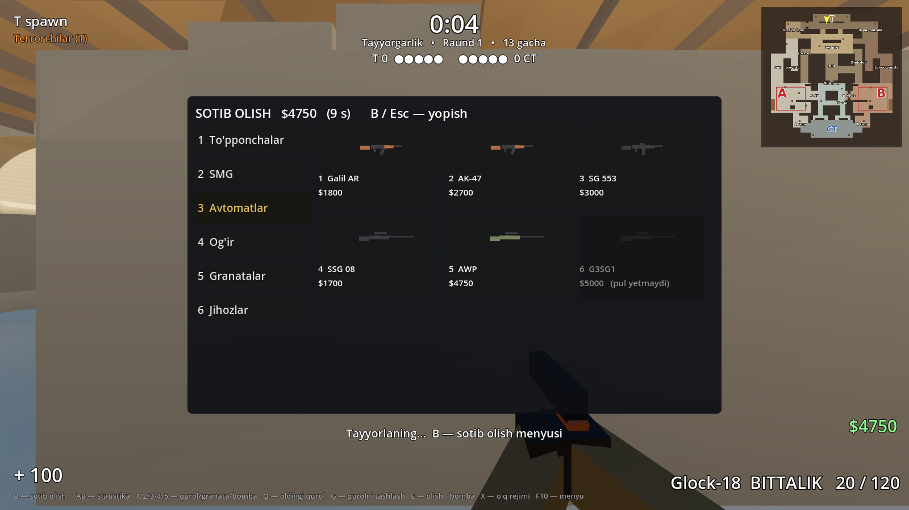
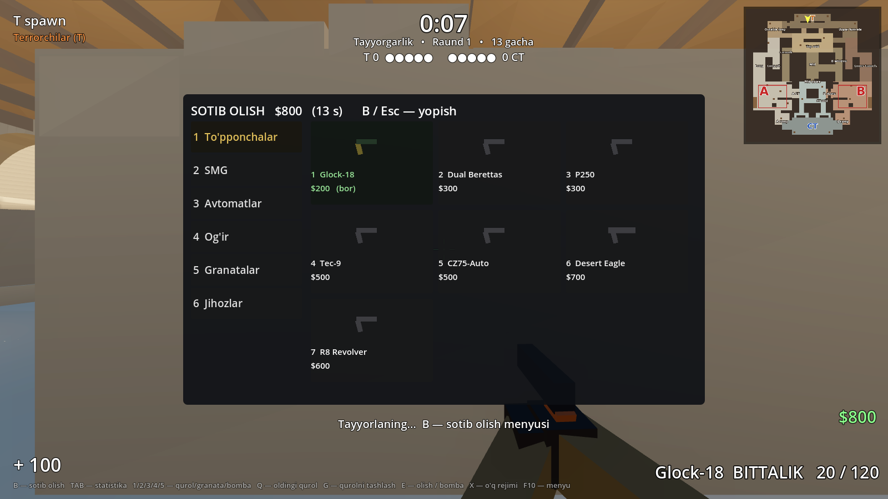
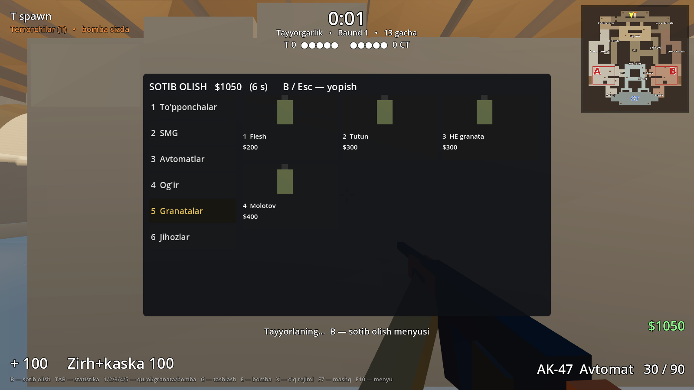
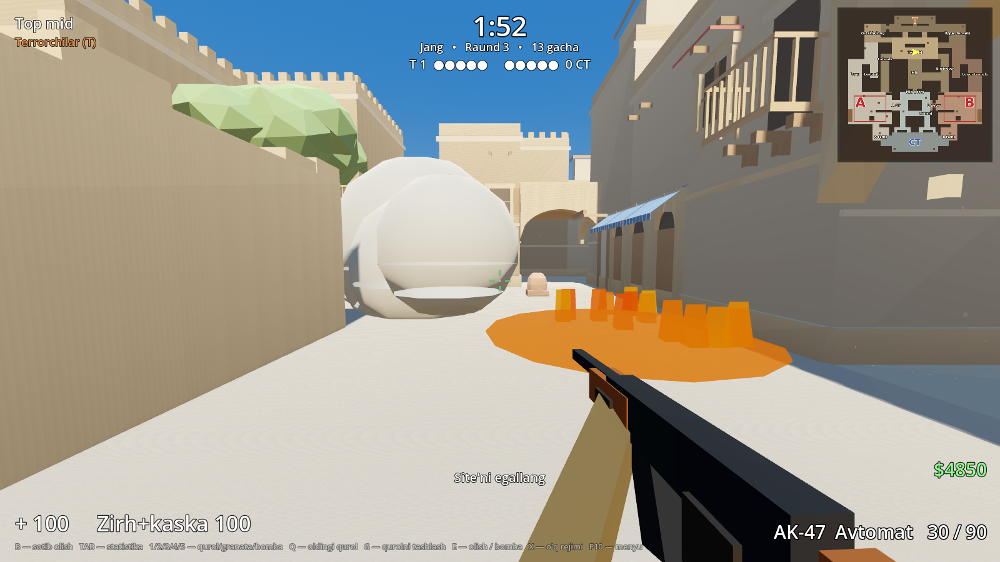
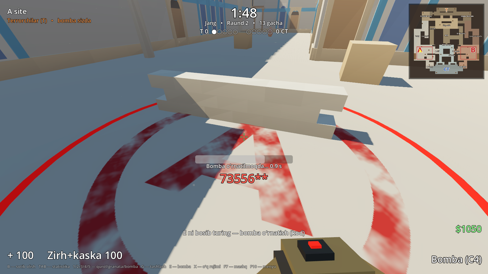
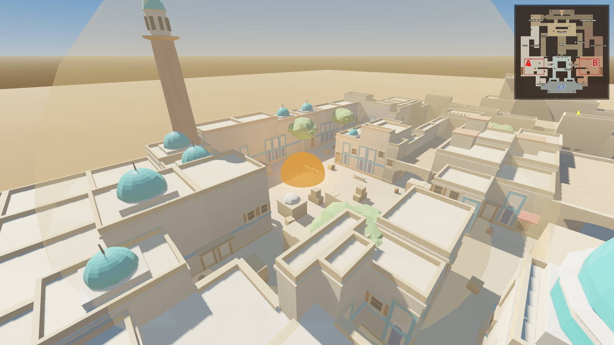
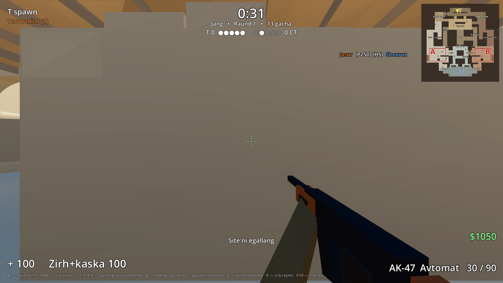
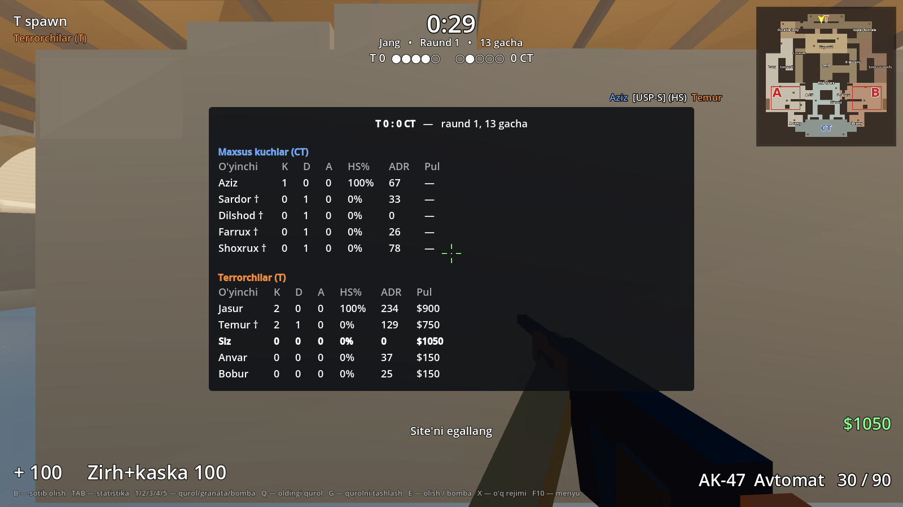

# 12-bosqich: botlar, audit va CS2 qoidalari (1 ga 1)

Tekshiruvlar: 5v5 Godot **@@T5@@**, 3v3 xaritaning o'z testlari **@@T3@@**, botlar bilan o'yin 5v5 **@@B5@@**, 3v3 **@@B3@@**,
3v3 audit **@@A3@@**, smoke **@@SM@@**, 5v5 audit **@@A5@@**.
Eski fayllar (qahramonlar, animatsiyalar, AKM/M416) o'chirilmadi.

## 1. Pul (CS2 raqobat rejimi)

| Qoida | Qiymat |
|---|---|
| O'yin boshida, yarim vaqtdan keyin | hammaga **$800** |
| Pul chegarasi | $16000 |
| Raund g'alabasi | hammani o'ldirish / vaqt: **$3250**; bomba portladi / zararsizlantirildi: **$3500** |
| Mag'lubiyat bonusi | $1400 → $1900 → $2400 → $2900 → $3400 (hisoblagich 1 dan boshlanadi: birinchi mag'lubiyat **$1900**; yutganda bir pog'ona tushadi) |
| Bomba o'rnatildi, T yutqazdi | har T ga **+$800** |
| Bombani o'rnatgan / zararsizlantirgan | +$300 |
| Vaqt tugadi, T tirik qoldi | tirik T lar mag'lubiyat pulini **olmaydi** |
| O'ldirish mukofoti | qurolga qarab: to'pponcha/avtomat $300, SMG $600 (P90 $300), drobovik $900 (XM1014 $600), AWP $100, Zeus $100, pichoq $1500, granata $300 |
| Assist | o'ldirmagan, lekin ≥ 41 zarar bergan |

MR12: 13 g'alabagacha, 12 raunddan keyin tomonlar almashadi (pul $800, qurollar yo'qoladi, hisob almashadi).
12:12 da qo'shimcha vaqt MR3: hammaga $12500, g'alaba uchun yana 4 (16, keyin 19 …).
3v3 — CS2 Wingman: 9 g'alabagacha, tayyorgarlik 10 s, raund 1:30, bomba 40 s.

## 2. Qurollar — CS2 raqamlari (`tools/gen_weapons.py` → `weapons/*.tres`)

| Qurol | Tomon | Narx | O'ldirish | Zarar | Zirh teshish | O'q/daq | Magazin | Tezlik |
|---|---|---|---|---|---|---|---|---|
| Glock-18 | T | $200 | $300 | 30 | 0.47 | 400 | 20/120 | 0.96 |
| USP-S | CT | $200 | $300 | 35 | 0.505 | 352 | 12/24 | 0.96 |
| P250 | ikkalasi | $300 | $300 | 38 | 0.64 | 400 | 13/26 | 0.96 |
| Tec-9 | T | $500 | $300 | 33 | 0.906 | 500 | 18/90 | 0.96 |
| Five-SeveN | CT | $500 | $300 | 32 | 0.911 | 400 | 20/100 | 0.96 |
| Desert Eagle | ikkalasi | $700 | $300 | 53 | 0.932 | 267 | 7/35 | 0.92 |
| MAC-10 | T | $1050 | $600 | 29 | 0.575 | 800 | 30/100 | 0.96 |
| MP9 | CT | $1250 | $600 | 26 | 0.6 | 857 | 30/120 | 0.96 |
| UMP-45 | ikkalasi | $1200 | $600 | 35 | 0.65 | 666 | 25/100 | 0.92 |
| P90 | ikkalasi | $2350 | $300 | 26 | 0.69 | 857 | 50/100 | 0.92 |
| Galil AR | T | $1800 | $300 | 30 | 0.775 | 666 | 35/90 | 0.86 |
| FAMAS | CT | $2050 | $300 | 30 | 0.7 | 666 | 25/90 | 0.88 |
| AK-47 | T | $2700 | $300 | 36 | 0.775 | 600 | 30/90 | 0.86 |
| M4A4 | CT | $3100 | $300 | 33 | 0.7 | 666 | 30/90 | 0.9 |
| SSG 08 | ikkalasi | $1700 | $300 | 88 | 0.85 | 48 | 10/90 | 0.92 |
| AWP | ikkalasi | $4750 | $100 | 115 | 0.975 | 41 | 5/30 | 0.8 |
| Nova | ikkalasi | $1050 | $900 | 9 × 26 | 0.5 | 68 | 8/32 | 0.88 |
| XM1014 | ikkalasi | $2000 | $600 | 6 × 20 | 0.8 | 171 | 7/32 | 0.86 |
| M249 | ikkalasi | $5200 | $300 | 32 | 0.8 | 750 | 100/200 | 0.78 |
| Zeus x27 | ikkalasi | $200 | $100 | 500 (4.6 m) | 1.0 | — | 1 | 0.88 |

Legend qurollari (LAR-01, AR-44, Spectre-9, Longbow-50, Breacher-12, Apex-9) ham menyuda qoldi — narx va tomon qo'shildi.

**Zarar formulasi (CS2):** `zarar = asos × masofa_koeffitsienti^(masofa / 12.7 m) × zona`; zona: bosh ×4, qorin ×1.25, tana/qo'l ×1, oyoq ×0.75.
**Zirh:** tana/qo'lga (kaska bo'lsa boshga ham) sog'liqqa `zarar × zirh_teshish` o'tadi, zirh `(zarar − o'tgani) × 0.5` ga kamayadi; oyoqni himoya qilmaydi.
Misol: AK-47 bosh — kaskasiz 144 (bitta o'q o'ldiradi), kaska bilan 111.6 (baribir o'ldiradi); tana 36 → zirh bilan 27.9.

**Raund boshida:** tirik qolganning qurollari, zirhi va granatalari qoladi, **o'qi to'ladi**; o'lganniki yo'qoladi — T Glock-18, CT USP-S bilan boshlaydi.
**Zeus:** 3 tugmasini pichoq ustida yana bossa — Zeus; bitta otishda o'ldiradi, keyin 30 s da qayta zaryadlanadi (HUD'da foiz).

## 3. Sotib olish menyusi (B) — CS2 uslubida

Bo'limlar: **1** To'pponchalar, **2** SMG, **3** Avtomatlar (snayperlar bilan), **4** Og'ir (drobovik, pulemyot), **5** Granatalar, **6** Jihozlar
(zirh $650, zirh+kaska $1000 — zirh bor bo'lsa kaska $350, zararsizlantirish to'plami $400 — faqat CT, Zeus $200).
Klaviatura: avval bo'lim raqami, keyin qurol raqami, 0 / Backspace — orqaga. Har kartochkada **qurol rasmi** (qurolning 3D shakli, kichik kamerada),
narxi va nima uchun sotib olib bo'lmasligi (pul yetmaydi / boshqa tomon quroli / bor / ko'pi bilan …). Faqat o'z tomonining qurollari ko'rinadi.
Granatalar: ko'pi bilan 4 ta, flesh 2 ta, qolganlari 1 tadan.

## 4. Granatalar (`grenade.gd`, `fire_area.gd`)

| Granata | Narx | Ishlashi |
|---|---|---|
| HE | $300 | 1.6 s dan keyin portlaydi, 8.9 m radius, ko'pi bilan ~98 zarar, devor to'sadi, zirh yarmini oladi |
| Flesh | $200 | 25 m ichida ko'rib turganni ko'r qiladi (to'g'ri qarasa ~4.9 s, orqa o'girsa qisqa); botlar ham ko'r bo'ladi |
| Tutun | $300 | to'xtagach yoyiladi, 18 s, radius 3 m, ko'rishni to'sadi (botlar ham orqasini ko'rmaydi), olovni o'chiradi |
| Molotov (T) / Yondiruvchi (CT) | $400 / $500 | polga tegsa yonadi: 2.8 m doira, 7 s, sekundiga ~35 zarar; tutun ichiga tushsa yonmaydi |

Tashlash: 4 — granata tanlash (yana bossa — keyingisi), sichqoncha chap — uzoqqa, o'ng — yaqinga.

## 5. Bomba

- **Faqat belgilangan aylanaga:** A va B da qizil halqa (radius 2.8 m, site markazida); site zonasining qolgan joyida o'rnatib bo'lmaydi.
- **Kod terish:** o'rnatish (3.2 s) davomida ekranda `7355608` kodi raqamma-raqam teriladi, har raqamda signal.
- **Olish / tashlash:** G — tashlash, ustidan yurilsa olinadi; bomba bilan o'lsa yerga tushadi.
- **Portlash:** zarar masofaga qarab (CS2: 500 × exp(−d² / 2σ²), σ = 14.8 m, 44 m gacha): 3 m — 490, 10 m — ~400, 20 m — ~200, 30 m — ~65;
  zirh zararning yarmini oladi. **Zarba to'lqini** — shaffof shar va yerdagi chang halqasi 44 m gacha kengayadi, yaqindagilar o'ladi,
  uzoqdagilar yarador bo'ladi, ekran silkinadi.

## 6. Kill feed va TAB statistika

- **Kill feed** (o'ng yuqorida): kim → qaysi qurol bilan → kimni, boshga bo'lsa (HS); jamoa ranglarida, o'yinchi ishtirok etgani qizil fonda; 8 s ko'rinadi.
- **TAB:** har jamoa — ism, o'ldirdi / o'ldi / assist, HS %, ADR (raundiga o'rtacha zarar), pul (raqibniki ko'rinmaydi).
- **Raund oxirida:** kim yutdi, sababi va shu raundda qancha pul olindi.

## 7. Botlar — "professional" daraja (`bot_play.gd`)

- **Iqtisod:** pistol raund (zirh yoki to'pponcha + flesh, CT — to'plam), eco (tejash), force-buy (Galil/FAMAS yoki MAC-10/MP9 + zirh),
  to'liq xarid (AK-47/M4A4 + zirh-kaska + granatalar, CT — to'plam), har jamoada bitta snayperchi (AWP yoki SSG 08).
- **Burchaklarni tekshirish:** ushlab turganda xavfli tomonlarni navbat bilan tekshiradi (har tomondan kelishi mumkin), ovoz/jamoadosh
  xabari kelgan tomonga darhol buriladi, jamoadoshi o'lsa otuvchi tomonga qaraydi.
- **Yashirinish:** jarohatlangan CT orqaroqqa chekinadi, olovdan chiqib ketadi, flesh ko'r qilsa otmaydi.
- **Bomba o'rnatilgan site'ga yordam:** kamida ikki kishi yig'ilib qaytarib oladi (vaqt kam bo'lsa — darhol), kirishda flesh;
  umid yo'q bo'lsa (1 ga 3+, vaqt yetmaydi) — qurolni saqlab qoladi. T lar o'rnatgandan keyin himoya joylarida turadi,
  bomba zararsizlantirilayotganda **molotov** tashlaydi.
- **Granatalar:** hujumdan oldin smoke lineup'lari va site ichiga flesh; site'ga kirishda CT burchagiga molotov; dushman yashiringan joyga HE;
  CT — site'ga ko'p T kirsa yondiruvchi.
- **Aim (qurolga qarab):** reaksiya 0.18–0.32 s; xato = mo'ljal xatosi (kuzatgan sari kamayadi, oldindan qaralgan joyda kichik)
  + qurol tarqalishi (harakatda katta — bot to'xtab otadi) + tepki (80 % nazorat); yaqinda spray, o'rtada 3–4 lik burst, uzoqda bittalab;
  har o'q aniq geometriya bilan (bosh / ko'krak / qorin / qo'l / oyoq) — "har tomonga" otmaydi; magazin tugasa qayta o'qlaydi.

@@BOTSTATS@@

## 8. Oldingi so'rov: botlar, audit, 3v3 qorayish

- Botlar 5v5 va 3v3 da (`Bots` tuguni): o'yinchi + jamoadoshlar va raqiblar, o'yinchi o'lsa jamoadoshini kuzatadi.
- Vizual audit (ko'rinmas devor / arvoh devor): ravoq to'qnashuvi egri chiziqqa moslandi (5v5 va 3v3), 3v3 egilgan palma va qum qoplari tuzatildi.
- 3v3 da yurganda ekran qorayishi: ReflectionProbe atrof yorug'ligi va SDFGI o'chirildi, yorug'lik qayta sozlandi.

## Fayllar

| Fayl | Nima |
|---|---|
| `scripts/cs_rules.gd` | hamma CS2 raqamlari: pul, bonuslar, granatalar, jihozlar, bomba, Zeus, qurollar katalogi |
| `scripts/loadout.gd` | har o'yinchi/botning puli, qurollari, zirhi, granatalari, statistikasi; sotib olish qoidalari |
| `scripts/combat.gd` | zarar: zirh/kaska → sog'liq → statistika (o'yinchi ham, bot ham) |
| `scripts/game_mode.gd` | raund, pul taqsimoti, MR12/OT, bomba aylanasi va kodi, portlash zarari, kill feed |
| `scripts/hud.gd` | pul, zirh, granatalar, kill feed, kod, TAB, raund natijasi, flesh |
| `scripts/buy_menu.gd` | CS2 uslubidagi menyu, qurol rasmlari |
| `scripts/grenade.gd`, `scripts/fire_area.gd` | HE, flesh, tutun, molotov/yondiruvchi |
| `scripts/bomb.gd` | portlash va zarba to'lqini |
| `scripts/bot_play.gd` | botlar: iqtisod, taktika, granatalar, aim |
| `tools/gen_weapons.py` | CS2 qurollari (`weapons/*.tres`) |
| `tools/godot_src/tools/cs2_shots.gd` | shu hisobotdagi skrinshotlar |
