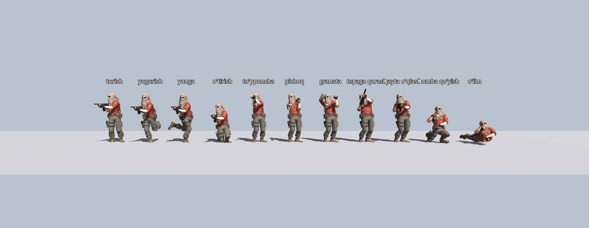
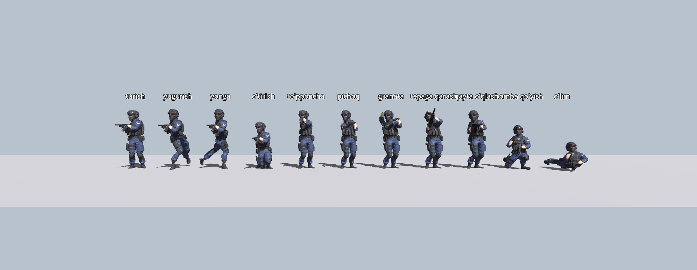
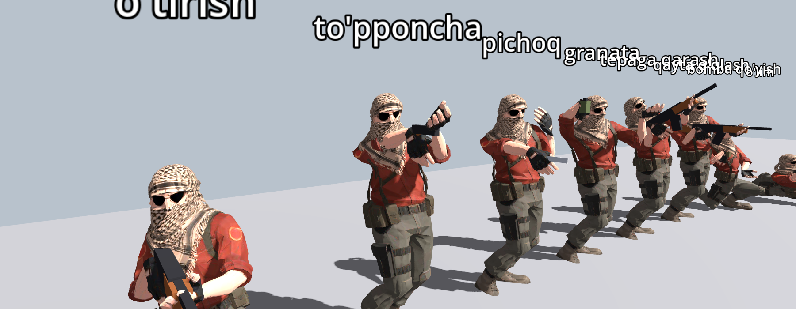
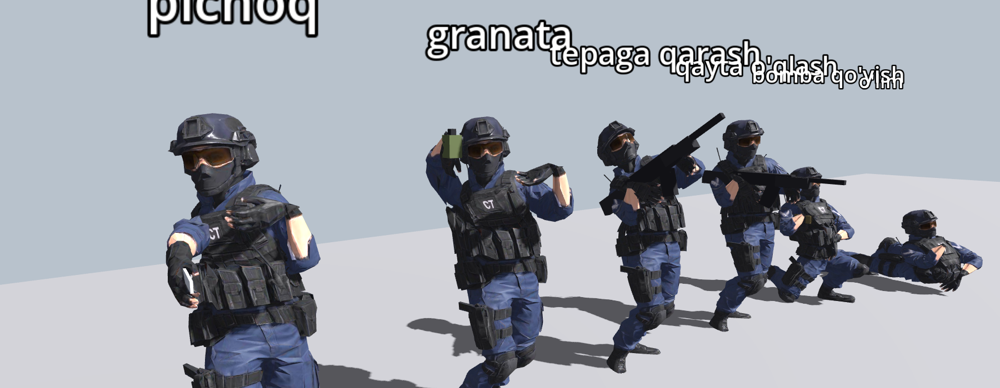
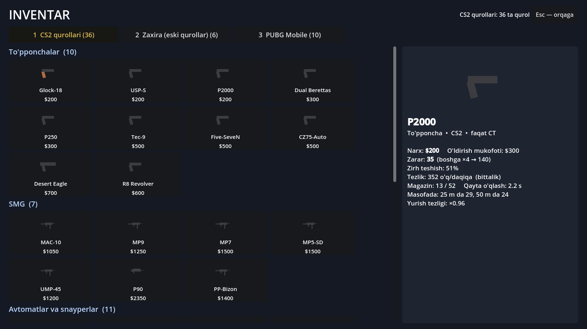
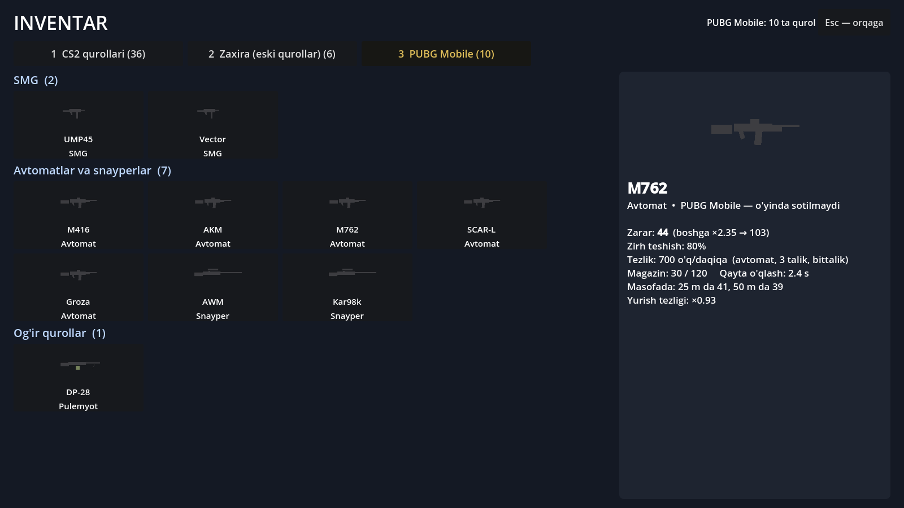

# 13-bosqich: T va CT 3D modellari (3-shaxs animatsiyalari), inventar, CS2 qurollari, qurol tashlash/olish, botlar

Tekshiruvlar: 5v5 Godot **@@T5@@**, 3v3 xaritaning o'z testlari **@@T3@@**, botlar bilan o'yin 5v5 **@@B5@@**, 3v3 **@@B3@@**,
3v3 audit **@@A3@@**, smoke **@@SM@@**, 5v5 audit **@@A5@@**. Eski fayllar o'chirilmadi.

## 1. Qahramonlar: siz bergan modellar asosida 3-shaxs animatsiyalari

| | T | CT |
|---|---|---|
| Model | "Desert Shadow Operative" (`assets_src/t_shadow_operative.glb`) | "Counter Terrorist Operative" (`assets_src/ct_operative.glb`) |
| O'yinda | `godot/characters/t_shadow.glb` (2.2 MB) | `godot/characters/ct_operative.glb` |
| Skelet | modelning o'zi (Meshy auto-rig, Mixamo 28 suyak) — og'irliklar o'zgarmadi | xuddi shunday |

`tools/rig_operatives.py t_shadow | ct_operative` (Blender bpy):
- suyaklar bizning nomlarga o'tkaziladi, qo'l/oyoq "roll"i IK uchun to'g'rilanadi, bo'y 1.80 m (o'yindagi kapsula bilan bir xil);
- qo'shiladi: `weapon` suyagi (qurol shu yerga ulanadi — kelajakda siz bergan qurol modellari ham), `mag` (qayta o'qlashda magazin);
- **27 animatsiya**, haqiqiy odam harakatidan (CMU motion capture) + IK (qo'llar qurolda, oyoqlar yerda sirpanmaydi):
  turish; yurish / yugurish / o'tirib yurish — har biri 4 tomonga (12 ta); o'tirib turish; sakrash (boshlanish, havoda, qo'nish);
  bomba qo'yish (tiz cho'kib); o'lim (yiqilish); o'q uzish; qayta o'qlash (magazin almashadi);
  qo'l pozalari: to'pponcha, pichoq, granata, C4; harakatlar: pichoq zarbasi, granata otish.
- **Tuzatildi:** turish mocap klipida son burilishi oyoqlarga nisbatan ~107° yonga og'gan edi (tana yon tomonga qarab turardi) —
  `mocap5.py` endi hamma kliplarda son yo'nalishini oyoqlar chizig'iga to'g'rilaydi.

Godot'da (`scripts/rigged_body.gd`, `character_model.gd` ichidan ishlaydi — botlar va o'yinchining boshqalarga ko'rinadigan tanasi):
- AnimationTree: tezlik bo'yicha yurish/yugurish aralashmasi (BlendSpace2D), o'tirish, havoda, bomba qo'yish;
  qurol pozasi faqat yelka-qo'l suyaklariga (pastki tana yurishda davom etadi); o'q uzish / qayta o'qlash / zarba — faqat yuqori tana;
- nishonga qarash: tananing yuqori qismi tepaga/pastga egiladi (qurol bilan birga);
- bir qo'lli qurollar (to'pponcha, pichoq, granata, Zeus, C4) har kadrda o'ng kaftga qo'yiladi, og'zi nishonga qaraydi;
- o'lganda qurol qo'ldan tushadi (yerga — pastga qarang), tana "death" klipi bilan yiqiladi;
- **o'q zonalari suyaklarga bog'langan** (13 ta): bosh, ko'krak ×2, **qorin ×1.25 (CS2)**, qo'llar, oyoqlar — animatsiya bilan birga harakatlanadi.

**1-shaxs butunlay alohida:** o'yinchi kamerasidagi qo'l va qurol (`character_model.gd`, `first_person=true`) bu modellarga
umuman bog'liq emas — o'z kamerasi o'z 3-shaxs tanasini ko'rmaydi (11-qatlam), boshqalar esa faqat 3-shaxs tanani ko'radi.

## 2. Qurollar va inventar

- **Sotib olish menyusi = CS2**: 34 ta qurol — to'pponchalar 10 (Glock-18, USP-S, P2000, Dual Berettas, P250, Tec-9, Five-SeveN,
  CZ75-Auto, Desert Eagle, R8 Revolver), SMG 7 (MAC-10, MP9, MP7, MP5-SD, UMP-45, P90, PP-Bizon), avtomat/snayper 11 (Galil AR, FAMAS,
  AK-47, M4A4, M4A1-S, SG 553, AUG, SSG 08, AWP, G3SG1, SCAR-20), og'ir 6 (Nova, XM1014, Sawed-Off, MAG-7, M249, Negev) + pichoq, Zeus.
  SG 553 / AUG — o'ng tugma bilan yaqinlashtirish; G3SG1 / SCAR-20 — optika. Narx, zarar, zirh teshish, o'q/daq, magazin — CS2 raqamlari.
- **O'zimiz yasagan qurollar** (LAR-01, AR-44 Vanguard, Spectre-9, Longbow-50, Breacher-12, Apex-9) — sotib olishdan olindi,
  **inventardagi "Zaxira" bo'limida** saqlanadi.
- **PUBG Mobile — eng mashhur 10 ta**: M416, AKM, M762, SCAR-L, Groza, AWM, Kar98k, UMP45, Vector, DP-28 (inventarda, o'yinda sotilmaydi).
- **Inventar** (bosh menyu → 4): uch bo'lim (CS2 / Zaxira / PUBG Mobile), har qurolning nomi, rasmi va to'liq ma'lumoti
  (narx, zarar, bosh, zirh teshish, tezlik, magazin, masofada zarar, yurish tezligi).

## 3. Qurolni tashlash, olish, almashtirish (CS2)

| Tugma / holat | Nima bo'ladi |
|---|---|
| **G** | qo'ldagi qurol (asosiy yoki to'pponcha) oldinga otiladi va yerda yotadi (fizika bilan); 5-slotda — bomba |
| ustidan yurib o'tish | shu turdagi joyingiz bo'sh bo'lsa — avtomatik olinadi (magazin/zaxira saqlanadi) |
| **E** (qurolga qarab) | olinadi, qo'lingizdagi o'sha turdagi qurol yerga tushadi; ekranda "E — AWP ni olish ($4750)" |
| o'lganda | eng yaxshi quroli (asosiy, bo'lmasa to'pponcha) yerga tushadi — boshqalar olishi mumkin (botlar ham) |
| yangi raund | yerdagi qurollar yo'qoladi |
| **Q** | oldingi qurolga qaytish |

Qo'shimcha CS2 funksiyasi: **tagging** — o'q tekkanda 0.4 s sekinlashish.

## 4. Botlar: "chiqishi bilan urib qo'yish" tuzatildi

Oldin reaksiya 0.1–0.28 s, mo'ljal xatosi 0.35 s da yo'qolardi va o'qlarning ~63% boshga qaratilardi — bot ko'rinishi bilan urardi.
Endi odamga o'xshash:
- **reaksiya** 0.26–0.42 s (ko'rish + qaror); qarab turgan tomondan uzoqda chiqsangiz — burilish uchun +0.14 s (90°) … +0.28 s (orqada);
  o'zi yurayotgan bo'lsa — to'xtash +0.12 s; uzoqdagi va o'tirgan nishonni sezish qiyinroq;
- **birinchi o'qlar ko'pincha tegmaydi**: burilib kelgan mo'ljal xatosi 0.03 rad (20 m da ~60 sm), kuzatgan sari ~0.5 s da aniqlashadi;
  oldindan qarab turgan burchakda kichikroq (0.014);
- **boshga mo'ljal kamroq**: yaqinda ~40%, o'rtada ~30%, uzoqda ~15%, spray paytida ko'krakka; harakatlanayotgan nishonga qiyinroq.

@@BOTSTATS@@

## 5. Grafika

Xarita uslubi (siz tanlagan low-poly) saqlandi, yorug'lik realistikroq qilindi: burchak/devor tagidagi soyalar (SSAO) kuchliroq,
quyoshdan qaytgan iliq yorug'lik (SSIL), yorqin sirtlarda yengil nur (glow), uzoqlik havosi (aerial perspective), yumshoq quyosh
soyasi (burchak o'lchami 0.6°, bo'laklar orasida silliq o'tish), kontrast. Qahramonlar endi haqiqiy teksturali 3D modellar.
Eslatma: SSAO/SSIL/glow va yumshoq soyalar Forward+ renderda (sizning kompyuteringizda) ko'rinadi; bu yerdagi skrinshotlar
"compatibility" renderda olingan.

## Fayllar

| Fayl | Nima |
|---|---|
| `tools/rig_operatives.py` | T va CT: skelet tayyorlash, 27 animatsiya (bpy, CMU mocap + IK) |
| `tools/mocap5.py` | mocap treklari (son yo'nalishi tuzatildi) |
| `scripts/rigged_body.gd` | 3-shaxs model: AnimationTree, qurol, o'q zonalari, nishonga egilish |
| `scripts/weapon_drop.gd` | yerdagi qurol |
| `scripts/inventory.gd`, `inventory.tscn` | inventar ekrani |
| `scripts/weapon_icon.gd` | qurol rasmlari (menyu va inventar) |
| `tools/gen_weapons.py` | 34 CS2 + 10 PUBG Mobile qurollari, zaxira |
| `tools/godot_src/tools/t_shots.gd`, `inv_shot.gd` | skrinshotlar |
