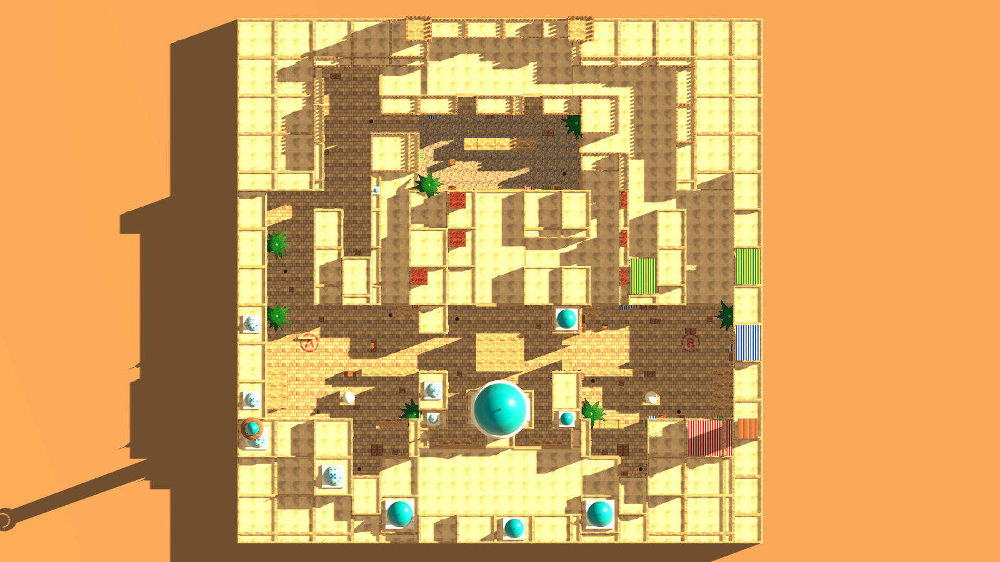
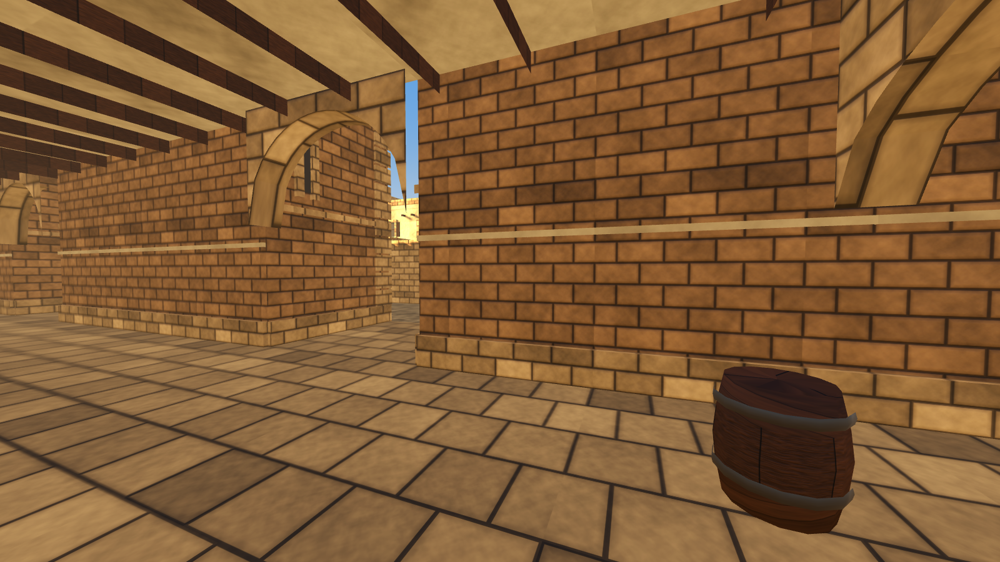
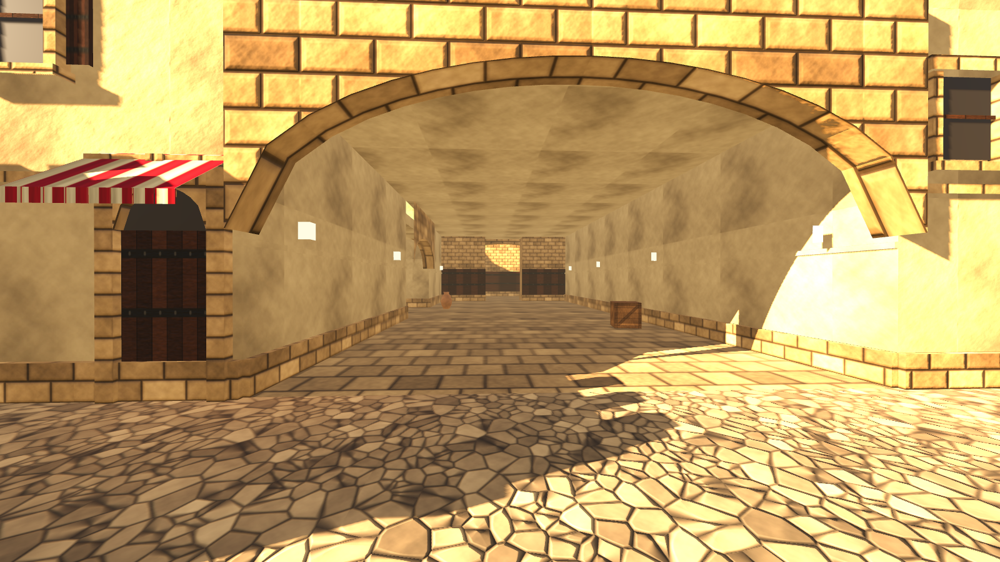
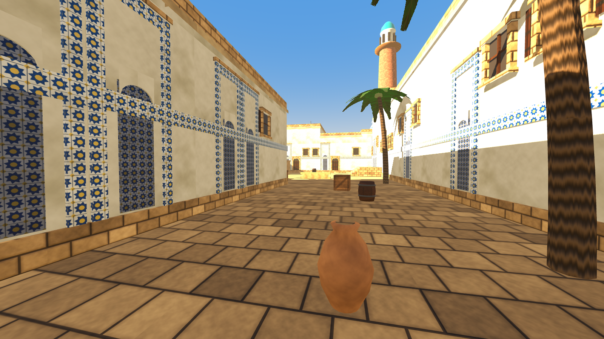
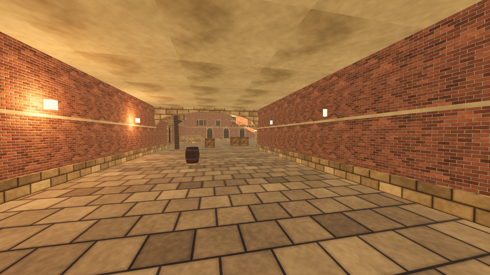
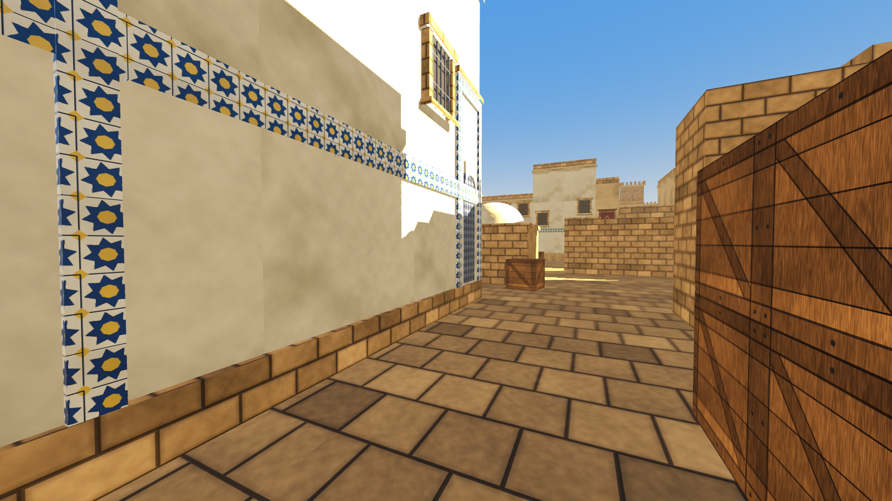
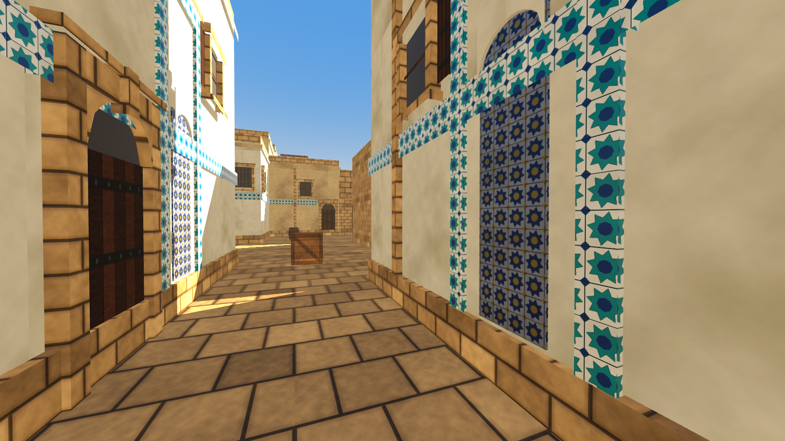
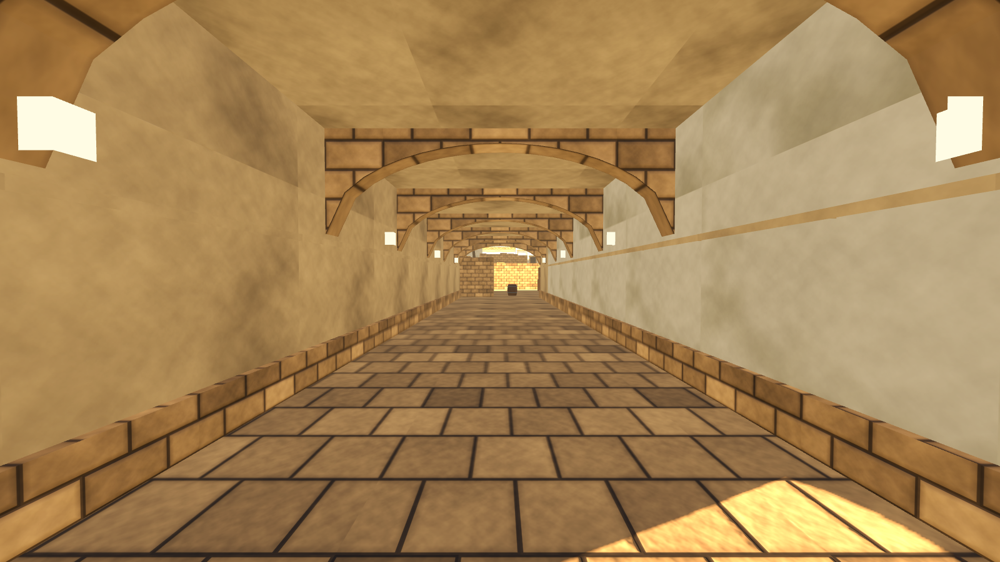

# 2-bosqich: Godot greybox — hisobot

> Eslatma: skrinshotlar 4-bosqichda arxitektura bilan yangilangan. Greybox ko'rinishi `main_greybox.tscn` da.

**Natija: 79 / 79 avtomatik test o'tdi** (Godot 4.3, haqiqiy fizika bilan). 2D tahlil: 59 / 59.

Greybox — binolari oddiy qutilardan iborat, lekin to'liq o'ynaladigan xarita. Chiroyli arxitektura
4-bosqichda qo'shiladi. Hozir maqsad: o'lcham, yo'llar, panalar va vaqtlarni qo'lda sinab ko'rish.



## Qanday ochish va o'ynash

1. [Godot 4.3](https://godotengine.org/download) ni o'rnating.
2. Godot → **Import** → `qumtepa-5v5/godot/project.godot` → **Import & Edit**.
   Birinchi ochilishda model import qilinadi (bir necha soniya).
3. **F5** — o'ynash.

| Tugma | Amal |
|---|---|
| WASD, sichqoncha, Space | yurish, qarash, sakrash |
| E | bomba o'rnatish / zararsizlantirish (bosib turish) |
| G | bombani tashlash |
| B | sotib olish menyusi |
| **F1** | zonalar, spawn'lar, **34 ta bot nuqtasi** va **10 ta smoke nishoni**ni ko'rsatish |
| F2 | jamoani almashtirish (T ↔ CT) |
| F3 | raundni qayta boshlash |
| Esc | sichqonchani bo'shatish |

**Ranglar:**
- **Pol:** ochiq joy qum rang, yopiq yo'lak to'qroq, site'lar qizg'ish, T spawn to'q sariq, CT spawn ko'kish.
- **Panalar:** to'q jigarrang panalar ko'rishni to'sadi (2 qavat qutilar). To'q sariqlar past, ularning ustidan otish mumkin.
- **To'r:** har 1 m da chiziq, har 4 m da qalinroq. Masofani ko'z bilan baholash uchun.

## Nima qurildi

| Qism | Tafsilot |
|---|---|
| Geometriya | 149 ta bino bloki (6.5–11 m), yopiq yo'laklar tomi (4.2 / 5.2 m), chegaralarda arkalar, 88 ta pana va obyekt, 2 ta zinapoyali platforma. Jami 21 ming uchburchak |
| To'qnashuv | 329 ta birlashtirilgan quti. Sirt turlari: tosh, yog'och, metall, mato (qadam tovushlari uchun) |
| Clip'lar | Xarita ustida 12 m da qopqoq. Yopiq yo'lak tomlari, xarobalar, quduqlar va devorchalar ustiga chiqib bo'lmaydi. Granata 30 m gacha uchadi va chegaradan chiqmaydi |
| Yorug'lik | Quyosh (soyalar 140 m gacha), yopiq yo'laklarda 52 ta chiroq |
| NavMesh | 1051 poligon, agent radiusi 0.5 m. 34 ta bot nuqtasining hammasiga yo'l bor |
| O'yin | 5+5 spawn, sotib olish zonalari, A/B bomba zonalari, raund: tayyorgarlik 12 s, raund 1:55, bomba 40 s, zararsizlantirish 10 s |
| Callout | 32 ta nom, ekranda joriy joy nomi ko'rinadi |

O'yin skriptlari (o'yinchi, raund, HUD, bomba) Qumtepa v2 dan o'zgarishsiz olindi. Ular xaritaga bog'liq emas.
Xaritaga bog'liq hamma narsa `layout5.py` dan avtomatik yaratiladi.

## 2D tahlil va 3D fizika

O'yinchi NavMesh yo'li bo'ylab haqiqiy fizika bilan yurgizildi (4.5 m/s):

| Yo'l | 2D reja | 3D fizika | Farq |
|---|---|---|---|
| T → A (Long) | 20.5 s | 19.6 s | −4% |
| T → A (Short) | 18.0 s | 17.1 s | −5% |
| T → B (Tunnels) | 20.3 s | 19.5 s | −4% |
| T → B (Window) | 18.1 s | 17.3 s | −4% |
| T → Mid doors | 12.8 s | 12.3 s | −4% |
| CT → A (Ramp / CT mid) | 13.3 / 13.3 s | 12.8 / 12.8 s | −4% |
| CT → B (Ramp / B doors) | 13.3 / 13.3 s | 12.5 / 12.7 s | −5% |
| CT → Mid doors | 9.8 s | 9.4 s | −4% |

- **3D vaqtlar 2D dan 4–5% tezroq.** 2D tahlil 0.25 m to'rda yurgan, 3D esa burchaklarni silliq kesib o'tadi.
  Farq hamma yo'lda bir xil, shuning uchun muvozanat o'zgarmaydi.
- **A va B 3D da ham teng.** T uchun eng tez yo'l A ga 17.1 s, B ga 17.3 s. CT uchun ikkalasiga 11.8 s.
  CT site'ga 5 s oldin yetadi.

## Testlar (79 ta)

| Guruh | Nima tekshiriladi |
|---|---|
| Spawn'lar | 5+5 joy, ostida pol bor, T va CT spawn'lari bir-birini ko'rmaydi (25/25 chiziq to'silgan) |
| Sirtlar | Tosh, yog'och, metall, mato to'g'ri aniqlanadi |
| Clip'lar | Xarita qopqog'i, yopiq tom, xaroba ustida clip bor, ochiq site ustida ortiqcha clip yo'q, granata chegarasi |
| Ko'rish | Mid doors eshigidan ko'rinadi, devor orqasidan ko'rinmaydi, 10 ta smoke nishonining tepasi ochiq |
| NavMesh | T/CT → A/B yo'llari, 34 ta bot nuqtasi |
| Vaqtlar | 14 ta yo'l 2D rejadan ≤ 12% farq qiladi, A/B muvozanati, CT ustunligi ≥ 4 s, ikkala platformaga zinapoyadan chiqiladi |
| Callout | 14 ta nuqta |
| Raund | Tayyorgarlik, sotib olish, o'rnatish/bekor qilish, zararsizlantirish, portlash, vaqt tugashi, bombani tashlash/olish, xaritadan tushish |

## Bu bosqichda topilgan va tuzatilgan muammolar

1. **T spawn devori va T ramp orasida 1.5 m tor yo'lak qolgan edi.** Skrinshotda ko'rindi. Devor surildi, o'tish 4.5 m bo'ldi.
   Spawn joylari 1 m chuqurroqqa ko'chirildi, shunda T vaqtlari o'zgarmadi. T sotib olish zonasi devor orqasigacha qisqartirildi.
2. **CT uchun A 1 s tezroq edi (3D da).** Sababi: B default boshqacha joylashgan va CT yo'lini to'sgan.
   Endi B default A default ning ko'zgu nusxasi.
3. **"Tunnel cho'ntagi" bot nuqtasiga yetib bo'lmasdi.** Nuqta qutiga juda yaqin edi, 2.5 m ga surildi.
4. **Godot eski teksturalarni ushlab qolgan edi.** Pol ko'k rangda chiqqan. `make_all.sh` endi har safar import keshini tozalaydi.

## Sizdan kerak: qo'lda sinov (15–20 daqiqa)

Avtomatik testlar "his-tuyg'u"ni o'lchay olmaydi. Iltimos, shularni sinab, fikringizni yozing:

1. **O'lcham.** Xarita juda katta yoki juda kichik tuyulmayaptimi? T spawn'dan A va B ga yugurib ko'ring.
2. **Yo'laklar.** Catwalk, B window, Tunnels, CT mid yo'laklari tor yoki keng emasmi?
3. **Site'lar.** A (ochiq, katta panalar) va B (zich, kichik panalar) qanday? Qayerda turib himoya qilgan bo'lardingiz?
4. **Mid doors.** Top mid'dan CT mid'ga eshik orqali qarang. Bu snayper dueli joyi. Qulaymi?
5. **Tiqilish.** Biror joyda tiqilib qoldingizmi, yoki kutilmagan joyga chiqib oldingizmi?
6. **F1 rejimi.** Smoke nishonlari va bot nuqtalari mantiqiy joydami?

## Qayta yaratish

```
cd qumtepa-5v5/tools
pip install numpy scipy pillow trimesh
GODOT=/yo'l/godot4 ./make_all.sh      # tahlil → 3D → Godot loyihasi → NavMesh → testlar (~15 s)
```

Skrinshotlar: `cd qumtepa-5v5/godot && godot --rendering-method gl_compatibility -s res://tools/screenshots.gd`.
Serverda ekran bo'lmasa, oldiga `xvfb-run` qo'shing.

## Cheklovlar

- **Botlar hali yurmaydi.** Hozircha faqat nuqtalar va NavMesh tayyor. 5v5 bot o'yinlari 3-bosqichda.
- **Qurol va otishma yo'q.** Qumtepa v2 da ham yo'q edi. Ko'rish chiziqlari ray bilan tekshirildi.
- **Skrinshotlar Compatibility renderida olingan.** Godot'da (Forward+) soyalar va SSAO yaxshiroq ko'rinadi.
- **Palma va chiroqlar oddiy shakllar.** Bu greybox uchun yetarli. 4–5-bosqichda almashtiriladi.

## Skrinshotlar

| | |
|---|---|
|  T spawn → T ramp |  Top mid → Mid doors |
|  Long → A site |  Tunnels → B site |
|  A ramp → A site |  CT mid |
|  Catwalk | |
