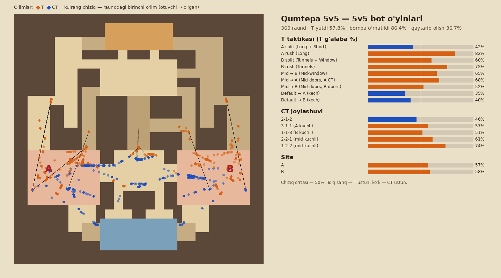
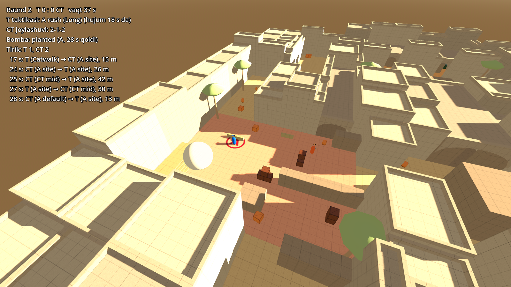

# 3-bosqich: balans sinovi — hisobot

**Natija:** A va B site'lar teng. Smoke'larning hammasi haqiqiy fizikada ishlaydi. 5v5 botlar bilan
**1080 raund** o'ynaldi (3 seed × 360). Bitta nosimmetriklik topildi va tuzatildi.
Barcha testlar o'tdi: 2D 59/59, Godot 79/79, smoke 10/10.

## 1. Smoke'lar: granata fizikasi bilan lineup'lar

2D rejadagi otish masofalari (38–40 m) haqiqiy granata uchun juda uzoq bo'lib chiqdi. Binolar ustidan oshirib
otilganda granata taxminan 30 m uchadi. `tests/run_grenades.gd` har bir smoke uchun o'z jamoasi hududida
eng yaqin ishlaydigan otish joyini topadi. Granata ko'z balandligidan otiladi va tom, devor yoki clip'ga
urilmasdan nishondan ≤ 1.8 m ga tushishi kerak. **10/10 topildi**, reja shu joylarga yangilandi.

| Smoke | Jamoa | Qayerda turib | Yo'nalish | Ko'tarish | Uchish |
|---|---|---|---|---|---|
| A CT | T | Long pit (−31.5, −9) | 28° | 70° (baland) | 3.9 s |
| A ramp | T | Catwalk chiqishi (−21, −1) | −13° | 19° (tekis) | 1.6 s |
| A platforma | T | Long pit (−31, −8) | −25° | 68° | 3.9 s |
| B doors | T | B window chiqishi (19.8, −1) | −5° | 19° (sekin otish) | 1.3 s |
| B ramp | T | B window chiqishi (21, −1) | 13° | 19° | 1.6 s |
| B platforma | T | Lower tunnels (42, −8) | 4° | 15° | 1.4 s |
| Mid doors | T | Top mid (−4, −26.5) | 7° | 61° | 3.7 s |
| Long chiqishi | CT | A ramp (−29, 37.5) | −155° | 63° | 3.8 s |
| Tunnel chiqishi | CT | B ramp (30, 34.5) | 154° | 67° | 3.9 s |
| Top mid | CT | CT mid (6, 11) | −169° | 63° | 3.8 s |

Yo'nalish: 0° — janub (CT tomon), 90° — sharq (B tomon). Aniq qiymatlar `smokes_stage3.json` da.
Yopiq yo'laklardan (Catwalk, B window, Tunnels) smoke faqat tekis otiladi, chunki tom baland otishga to'sqinlik qiladi.

## 2. 5v5 bot o'yinlari

**Botlar nima qiladi:** NavMesh bo'ylab yuradi, taxminan 140° ko'rish maydoni bilan ≤ 70 m gacha ko'radi.
Smoke va devorlar ko'rishni to'sadi. Otishma modeli:
- **Reaksiya:** 0.2–0.35 s. Harakatda sekinroq, oldindan mo'ljallangan burchakda tezroq.
- **Aniqlik:** masofa bilan tushadi. Harakatda otganda yarmiga kamayadi. Faqat boshi ko'rinsa, ya'ni past pana ortida bo'lsa, taxminan 0.55 ga kamayadi.

**T tomoni:** 9 ta taktika:
- **Split:** A (Long + Short) va B (Tunnels + Window).
- **Rush:** A (Long) va B (Tunnels).
- **Mid orqali:** B ga Mid-window yo'lagidan, A ga Mid doors va A CT orqali, B ga Mid doors va B doors orqali.
- **Kech default:** A yoki B ga, raund o'rtasida hujum.

Har bir taktikada smoke'lar, bomba tashuvchi va o'rnatgandan keyin turish joylari bor.

**CT tomoni:** 5 ta joylashuv: 2-1-2, 3-1-1, 1-1-3, 2-2-1, 1-2-2. Bir site'da 2 yoki undan ko'p T ko'rilsa, mid'dagi CT lar
yordamga boradi, 3 yoki undan ko'p T ko'rilsa, boshqa site'dagilar ham boradi. Bomba o'rnatilsa, hammasi qaytarib olishga boradi.

Har bir taktika va joylashuv juftligi bir xil sonda o'ynaldi: 9 × 5 = 45 juftlik, har biri 8 raund.

### Natijalar

| | Seed 1 | Seed 2 | Seed 3 (tuzatishdan keyin) |
|---|---|---|---|
| T umumiy g'alabasi | 60.8% | 56.7% | 57.8% |
| T, A site'ga | 56.3% | 56.9% | **56.9%** |
| T, B site'ga | 64.5% | 56.5% | **58.5%** |
| Bomba o'rnatildi | 84.7% | 87.5% | 86.4% |
| O'rnatilgandan keyin CT qaytarib oldi | 34.4% | 40.0% | 36.7% |
| Birinchi o'lim | 16.3 s | 16.4 s | 16.4 s |

**Ko'zgu juftliklari (3 seed jami, har biri 120 raund):**

| A taktikasi | T % | B taktikasi | T % |
|---|---|---|---|
| A rush (Long) | 78 | B rush (Tunnels) | 72 |
| A split | 44 | B split | 59 |
| Mid → A (Mid doors) | 74 | Mid → B (Mid doors) | 60 |
| Default → A | 30 | Default → B | 34 |

Bir taktika 40 raundda ±8% gacha tasodifan tebranadi. Masalan, "A split" seedlar bo'yicha 57%, 32%, 42% chiqdi.
Shuning uchun faqat uchala seedda ham takrorlangan naqshlarga tayanildi.

### Xulosalar

- ✅ **A va B teng.** Tuzatishdan keyin farq 1.6 foiz (maqsad ≤ 10). Ko'zgu juftliklari ham ikki tomonga
  navbatma-navbat og'adi: rush va Mid doors A da kuchliroq, split va default B da. Hech bir site ustun emas.
- ✅ **Platforma duellari eng muhim.** Birinchi o'limlar ko'pincha shu yerda: A platforma ↔ Long, B platforma ↔ Lower tunnels.
  Bu rejalashtirilgan: CT platformadan uzun yo'lni ushlab turadi.
- ✅ **O'lim joylari tarqalgan.** Ular site'lar, CT mid, Mid doors va platformalar o'rtasida taqsimlangan.
  Birorta "tuzoq" (hamma o'ladigan yagona joy) yo'q.
- ⚠️ **T umumiy 58%, maqsad 45–55% edi.** Bu asosan bot mantig'idan. CT botlar sekin aylanadi va bittadan kelib qaytarib oladi
  (qaytarib olish 37%). Rush'lar kuchli, sekin default'lar kuchsiz (30–34%) chiqishi ham shuni ko'rsatadi.
  Haqiqiy o'yinchilar bilan bu farq odatda kamayadi. Shuning uchun raqamni bot sozlamalari bilan
  "to'g'rilab" qo'ymadim: botlar o'lchov asbobi sifatida o'zgarishsiz qoldi.
- ⚠️ **Mid doors smoke kuchli.** U bilan boshlangan mid taktikalari T uchun 60–74% natija berdi. Smoke CT mid himoyasini
  ko'r qiladi. Bu haqiqiy o'yindagi taktika, xarita xatosi emas. Lekin sizning qo'lda sinovingizda CT uchun
  qo'shimcha burchak kerakmi, shuni kuzatish kerak.

## 3. Topilgan va tuzatilgan muammolar

1. **Mid doors CT joyi.** Birinchi 18 raundda 11 ta birinchi o'lim bir xil bo'ldi: T mid'dan eshik chizig'ida turgan CT ni o'ldirgan.
   CT joyi eshikka qiyshiq burchakka ko'chirildi (−4, 7.5). Endi mid'dan to'g'ridan-to'g'ri ko'rinmaydi.
2. **B site'dagi baland quti ustuni.** "B o'rtasi" ustuni (2.4 m) tunnel chiqishi yonida, plant'dan 2 m narida turgan edi.
   U T ga platformadan butunlay yashirin xavfsiz joy bergan. A da bunday joy yo'q. Ustun past qutilarga almashtirildi.
   Seed 1 da B 64.5% edi, tuzatishdan keyin 58.5% (A 56.9%).
3. **Smoke otish joylari.** 2D rejada 38–40 m edi, fizikada ishlaydigan joylarga (16–35 m) ko'chirildi.
4. **"Long pit" qutisi otish joyiga xalaqit bergan edi.** Surildi.

## 4. Qanday ko'rish va qayta sinash

- **Bot o'yinini ko'rish:** Godot'da `bots.tscn` → **F6**. Boshqaruv:
  - sichqonchaning o'ng tugmasi + WASD/QE — erkin kamera;
  - **1–5** — T botlarni, **6–0** — CT botlarni kuzatish, Tab — erkin kamera;
  - Space — pauza, +/− — tezlik.

  Ekranda raund, taktika, bomba holati va kill-feed ko'rinadi.
- **Balans sinovi:** `godot --headless --fixed-fps 60 -s res://tests/run_bots.gd -- 360 3` (taxminan 8 daqiqa).
  Natija `docs/bots_stage3.json` ga yoziladi, rasmi: `python3 tools/report_bots.py`.
- **Hammasi birga:** `BOTS=360 GODOT=... ./tools/make_all.sh`.

## 5. Cheklovlar

- **Botlar soddalashtirilgan.** Ular granata, flesh, tovush eshitish, pul va qurol turlarini hisobga olmaydi.
  Geometriya va vaqt bo'yicha nomutanosiblikni yaxshi ko'rsatadi, lekin haqiqiy o'yinchilar sinovi o'rnini bosmaydi.
- **Smoke'lar hujum vaqtida nishonda paydo bo'ladi.** Uchish vaqti fizikadan olinadi, lekin otuvchi bot otish joyiga bormaydi.
- **Xarita hali greybox.** 4-bosqichdagi arxitektura (derazalar, balkonlar) yangi burchaklar qo'shmasligi kerak.
  Buni 4-bosqich oxirida shu sinovlarni qayta ishga tushirib tekshirish kerak.
