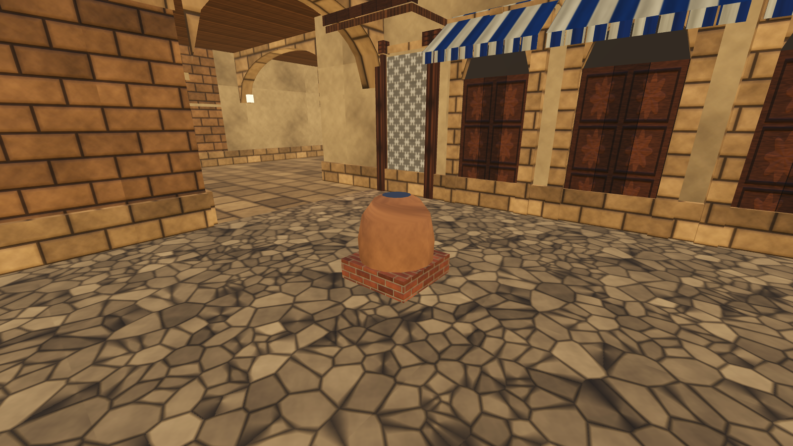
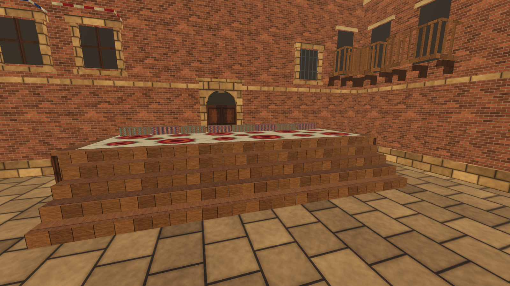
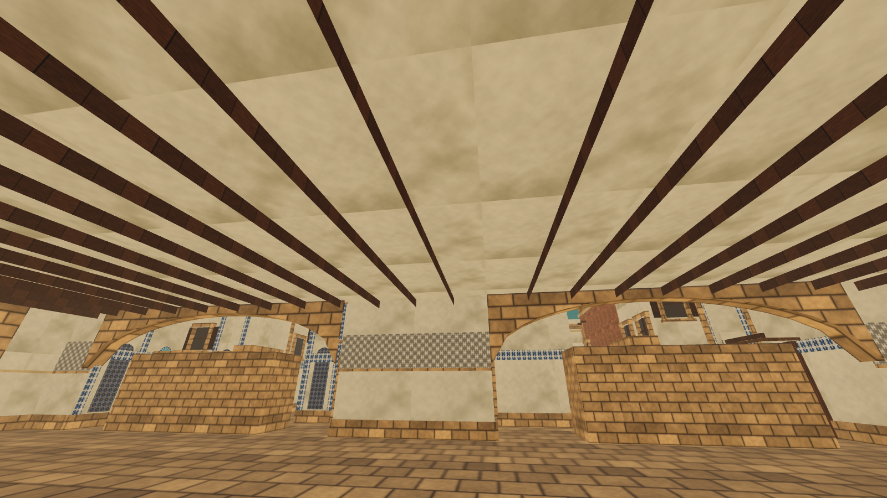

# 5-bosqich: milliy buyumlar va teksturalar — hisobot

**Natija:** xarita o'zbek xalq me'morchiligi va turmushidan olingan detallar bilan boyitildi. O'yin geometriyasi
o'zgarmadi: 986 ta to'qnashuv qutisi o'sha joylarda va o'sha o'lchamda, NavMesh 1047 poligon.
Testlar: 2D 59/59, Godot 79/79, smoke 10/10.

## Qoida (4-bosqichdagidek)

Yangi buyumlar faqat **mavjud panalar o'rniga, aynan o'sha o'lchamda** qo'yildi. Yangi to'siq, yangi pana yoki yangi
ko'rish chizig'i qo'shilmadi. O'zgargan yagona narsa sirt turi, ya'ni qadam tovushi:

| Oldin | Endi | Qayerda | Sirt (tovush) |
|---|---|---|---|
| Yog'och qutilar | **Paxta toylari** (qanor, arqon bog'ich) | Bozor, karvonsaroy | yog'och → mato |
| Bochkalar | **Tandir** (loy gumbaz, g'isht supa) | Bozor, masjid | yog'och → tosh |
| Tosh platformalar | **So'ri** (o'ymakor yog'och, ustida so'zana, atlas yostiqlar) | A va B platforma | tosh → yog'och |
| Palmalar | **Chinor** (oqish tana, shoxlar, barg toji) | Hamma joyda | o'zgarmadi |
| Badgir | **Kalta Minor** (Xiva): yo'g'on, qisqa, koshin tasmali minora | B orqasida | — (o'yin maydonidan tashqarida) |

## Milliy me'moriy detallar

| Detal | Ma'nosi | Qayerda |
|---|---|---|
| **Girih** koshin | O'n qirrali yulduzlar to'ri (Registon, Shohi Zinda) | Madrasa: friz va peshtoq ramkalari |
| **Majolika** | Xiva uslubidagi oq-ko'k islimiy koshin | Masjid: friz va peshtoqlar, Kalta Minor |
| **Ganch** o'ymakorligi | Oq gipsda chuqur o'yilgan naqsh | Ayvon ichi, CT spawn devorlari |
| **O'ymakor eshiklar** | Xiva uslubidagi panelli yog'och eshiklar, rozetkalar bilan | Hamma arkali eshiklar (qal'adan tashqari) |
| **Ayvon** | O'ymakor yarim ustunlar, vassa soyabon (3.3 m da) | Bozor, madrasa, masjid (17 ta) |
| **Vassa-bolor** shift | Zich terilgan yumaloq xodalar | Bozor, karvonsaroy, qal'a yopiq yo'laklari (Mid, Catwalk, Tunnels) |
| **Atlas va adras** | Ikat naqshli matolar | Bozor soyabonlari, so'ri yostiqlari |
| **So'zana** | Qizil gulli kashta | Devorlarda osilgan, so'ri ustida |
| **Rishton laganlari** | Ko'k-firuza sirli sopol | Bozor va masjid devorlarida |

4-bosqichdan qolganlar: madrasa peshtoqlari, minora, karvonsaroy balkonlari, masjid gumbazlari, qal'a burjlari, sardobalar.

## Raqamlar

| | 4-bosqich | 5-bosqich |
|---|---|---|
| Teksturalar | 21 | **30** (+ lagan va chinor barglari, alfa kanalli) |
| Uchburchaklar | 93 ming | 91 ming (palmalar chinorga almashdi) |
| Model hajmi | 13.3 MB | 14.7 MB |
| To'qnashuv qutilari | 986 | 986 (joyi va o'lchami bir xil) |

## Skrinshotlar

| | |
|---|---|
|  Bozor: tandir, atlas soyabon, o'ymakor eshiklar |  B platforma: so'ri, so'zana |
|  Top mid: paxta toylari, laganlar |  Mid: vassa shift |
|  A site: girih friz, chinor |  CT mid: majolika peshtoq |
|  B site: karvonsaroy, gumbazlar |  CT spawn: ganch devorlar |

## Cheklovlar

- **Teksturalar kod bilan chizilgan (512 px).** Naqshlar soddalashtirilgan: haqiqiy girih va majolika ancha nozik.
  Eng yuqori sifat kerak bo'lsa, haqiqiy yodgorliklar fotosuratlaridan tayyorlangan teksturalar qo'yish mumkin.
  Ularni `textures5.py` da almashtirish yetarli, qolgan kod o'zgarmaydi.
- **Paxta toylari va so'ridagi yostiqlar oddiy shakllar.** Ular qutilar kabi to'rtburchak.
- **Ichki xona va bozor rastalari yo'q.** Balans qoidasi tufayli yerda yangi buyumlar qo'yilmadi, chunki
  ular yo pana bo'lib qolardi, yo o'yinchi ularning ichidan o'tib ketardi.
