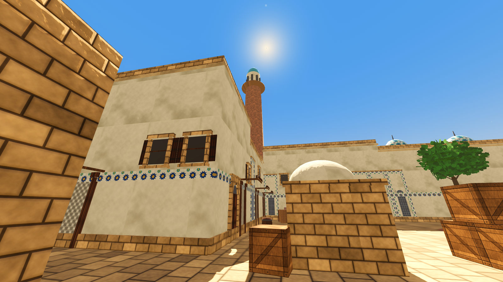
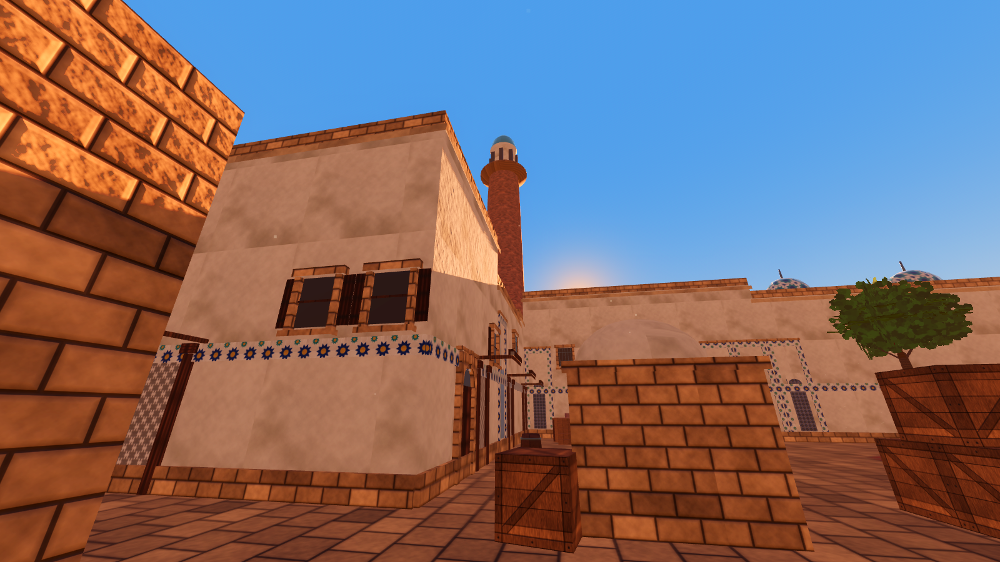
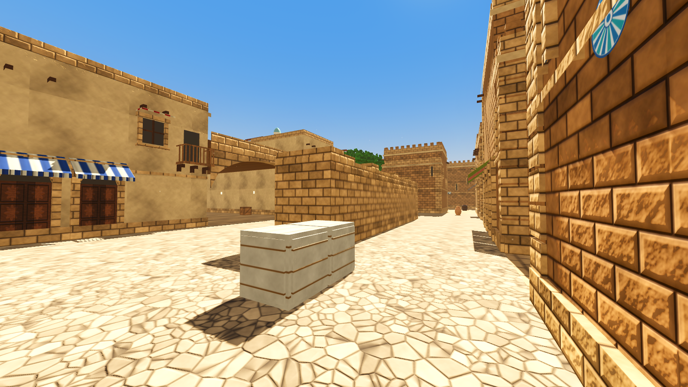
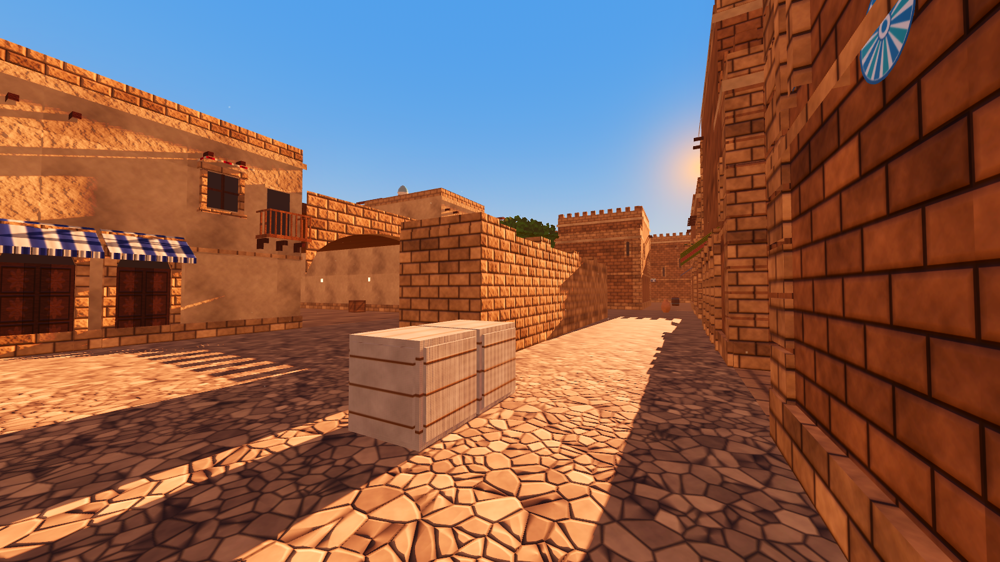

# 6-bosqich: yorug'lik, atmosfera va tovush — hisobot

**Natija:** xaritaga quyosh, osmon, havo, kechki (shom) rejim, har hududning o'z fon tovushi va yopiq joylarda
aks-sado qo'shildi. Hammasi raqobat qoidalariga moslangan: hech bir jamoa quyoshga qarab o'ynamaydi, qorong'i burchak yo'q,
fon tovushi qadam tovushini bosib ketmaydi. O'yin geometriyasi o'zgarmadi.
Testlar: 2D 59/59, Godot **88/88** (9 ta yangi), smoke 10/10, ko'rinish **17/17**.

| Kunduzi (raqobat rejimi) | Shom (F4) |
|---|---|
|  |  |
|  |  |

## Yorug'lik

- **Quyosh g'arbda, 50° balandlikda, sharq-g'arb o'qida** (shimol-janubga og'ishi 4°). T shimolda, CT janubda turgani uchun
  hech bir jamoa quyoshga qarab hujum yoki himoya qilmaydi. Soyalar aniq, lekin uzun emas.
- **Topilgan xato:** 2–5-bosqichlarda quyosh atigi **6°** balandlikda turgan ekan. Buni yangi test topdi: quyosh yo'nalishi
  noto'g'ri hisoblangan edi, soyalar juda uzun, yorug'lik esa past bo'lgan. Endi quyosh burchagi aniq beriladi va test tekshiradi.
- **Muhit (Forward+):**
  - **Soya va nur:** SSAO (burchak va tirqishlardagi soya), SSIL (yorug'likning devorlardan qaytishi), yengil glow.
  - **Rang:** ACES tonemap, rang to'yinganligi +6%.
  - **Tuman:** yengil tuman (zichlik 0.0015) va volumetrik "chang" havosi (0.004). Uzoq ko'rish chiziqlari xiralashmaydi.
- **Yopiq yo'laklar:** 52 ta devor chirog'iga qo'shimcha **ko'rinmas yumshoq yorug'lik** qo'yildi. Endi yopiq kataklarning hammasi
  (609 ta) chiroqdan ≤ 6 m uzoqlikda, ya'ni qorong'ida dushman yashirinadigan joy yo'q.
- **Havodagi chang:** A/B site, Top mid, CT mid va Long ustida sekin suzuvchi mayda zarralar. Faqat ko'rinish uchun,
  ko'rishni to'smaydi.
- **Shom rejimi (F4):** past to'q sariq quyosh, iliq tuman. Bu **faqat chiroyi uchun**: past quyosh A tomonga qaraganlarning
  ko'zini qamashtiradi, shuning uchun raqobatda ishlatilmaydi.

## Tovush

| Fon | Qayerda | Nimadan iborat |
|---|---|---|
| Bozor | Top mid, Mid | Olomon g'o'ng'irlashi, uzoqdagi idish-tovoq jiringlashi |
| Masjid | CT tomoni | Yengil shamol, kaptarlar |
| Madrasa | A site, Long | Shamol, chumchuqlar |
| Karvonsaroy | B site, Tunnels | Shamol, uzoqdagi tuya qo'ng'iroqchasi, yog'och g'ichirlashi |
| Qal'a | T tomoni | Kuchliroq shamol, bayroq hilpirashi |
| Yopiq yo'lak | Lower/Upper tunnels, Mid, Catwalk | Past gumburlash, suv tomchilari |

- **Tovushlar protsedural:** `tools/audio5.py` yaratadi, har biri 20 soniyalik choksiz halqa. Hammasi **−20…−22 dB** da,
  alohida "Ambient" shinasi orqali ijro etiladi. Ular yumshoq va keskin zarbalarsiz, shuning uchun qadam tovushi bilan adashtirilmaydi.
- **Aks-sado (reverb):** 609 ta yopiq katak birlashtirilgan zonalar bilan qoplangan. U yerdagi qadam, otishma va bomba tovushlari
  aks-sado beradi. Bu quloq bilan "tunnelda" yoki "ochiqda" ekanini bilishga yordam beradi.

## Yangi tekshiruvlar

**Godot testlari (15-bo'lim, 9 ta):**
- **Quyosh:** balandligi 40–65°, sharq-g'arb o'qida.
- **Muhit:** SSAO, SSIL va glow yoqilgan, tuman yengil.
- **Tovush shinalari:** Reverb va Ambient bor.
- **Fon tovushlari:** 9 ta manba, 6 xil. Hammasi halqada va ≤ −18 dB.
- **Aks-sado:** 609/609 yopiq katakda bor.
- **Yorug'lik:** 609/609 yopiq katak chiroqdan ≤ 6 m.

**Ko'rinish tekshiruvi** (`tools/check_shots.py`, `SHOTS=1 ./make_all.sh`):
- **Nima o'lchanadi:** 17 ta skrinshotning markaziy qismida (o'yinchi qaraydigan joy) o'rtacha yorqinlik.
- **Talab:** yorqinlik 0.22–0.85 oralig'ida, juda qorong'i piksellar 15% dan kam. **17/17 o'tdi**.

## Cheklovlar

- **Serverda videokarta yo'q.** Skrinshotlar Compatibility renderida olingan, unda SSAO, SSIL va volumetrik tuman ko'rinmaydi.
  Godot'da Forward+ bilan sahna boyroq ko'rinadi. Ko'rinish testi shunga qaramay o'tdi, ya'ni eng sodda renderda ham
  sahna o'yin uchun yetarlicha yorug'.
- **Tovushlar protsedural.** Ular haqiqiy yozuvlar emas, lekin halqali va baland emas. Istasangiz, haqiqiy yozuvlar bilan
  (bozor, azon emas — raqobat uchun neytral tovushlar) `godot/audio/amb_*.wav` fayllarini almashtirish kifoya.
- **FPS o'lchanmagan.** 100 ga yaqin nuqtali yorug'lik (soyasiz) va volumetrik tuman bor. Optimallashtirish 7-bosqichda.
