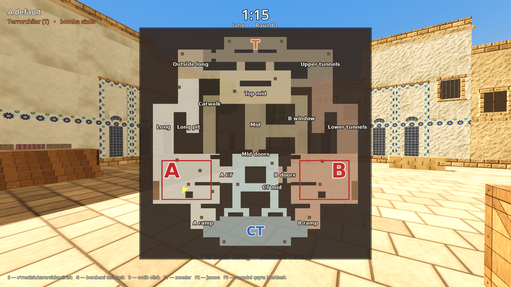

# 7-bosqich: optimallashtirish, minimap va yakuniy tekshiruv — hisobot

**Natija:** xarita tezroq ishlaydi, minimap va ishlash ko'rsatkichlari qo'shildi, yakuniy tekshiruvlar o'tdi.
O'rtacha ko'rinish nuqtasida chizilayotgan obyektlar va chizish buyruqlari **69% ga**, uchburchaklar **68% ga**,
kadr vaqti **29% ga** kamaydi. Testlar: 2D 59/59, Godot **93/93**, smoke 10/10, ko'rinish 19/19.

## Optimallashtirish

| Chora | Nima qiladi |
|---|---|
| **Hududiy bo'laklar** | Model 4×4 bo'lakka (27.5 m) ajratildi: 364 ta mesh bo'lagi. Kameraga ko'rinmaydigan bo'laklar chizilmaydi. Mo'ljal binolari va gumbazlar bo'linmaydi, ular uzoqdan ko'rinishi kerak |
| **Occlusion culling** | 105 ta bino blokiga soddalashtirilgan to'siq (occluder) qo'yildi. Bino orqasidagi narsa chizilmaydi |
| **Bezakni masofada yashirish** | Faqat sof bezak (226 bo'lak: derazalar, laganlar, soyabonlar...) 70 m dan uzoqda yumshoq so'nadi va soya tashlamaydi. **Panalar, devorlar va pol hech qachon yashirilmaydi**: o'yinchi uzoqdagi panani doim ko'radi (test tekshiradi) |
| **Quyosh soyasi** | 4 bo'lak / 140 m o'rniga 2 bo'lak / 80 m. Soya xaritasi har kadrda sahnani qayta chizadi, eng katta yutuq shu yerda |
| **Chiroqlar** | 102 ta nuqtali chiroq (soyasiz) 40–55 m dan uzoqda so'nadi |

### O'lchov (`godot/tools/perf.gd`, 12 ta ko'rinish nuqtasi, o'rtacha)

| | 6-bosqich holati | Optimallashtirilgan | Farq |
|---|---|---|---|
| Kadrdagi obyektlar | 832 | 256 | **−69%** |
| Chizish buyruqlari (draw calls) | 831 | 255 | **−69%** |
| Uchburchaklar (soya bilan birga) | 240 ming | 76 ming | **−68%** |
| Kadr vaqti* | 608 ms | 434 ms | **−29%** |

Eng og'ir nuqta (Top mid) optimallashtirilgandan keyin: 364 chizish buyrug'i, 101 ming uchburchak.

\* Serverda videokarta yo'q, dasturiy render (llvmpipe) ishlatildi. Shuning uchun ms qiymatlari real FPS emas,
faqat nisbiy taqqoslash uchun. Obyekt, chizish buyrug'i va uchburchak sonlari esa videokartaga bog'liq emas.
Haqiqiy FPS ni o'yinda **F9** bilan ko'rasiz.

## Minimap va ko'rsatkichlar

- **Minimap:** o'ng yuqori burchakda, shimol (T) tepada.
  - **Xaritada:** hudud ranglari, A/B zonalari, spawn'lar va callout nomlari.
  - **Belgilar:** o'yinchi sariq o'q bilan, bomba qizil nuqta bilan ko'rsatiladi.
  - **Katta xarita:** **M** tugmasi.
  - **Rasm:** `tools/minimap5.py` layout'dan avtomatik yaratadi.
- **Bot kuzatish rejimi (`bots.tscn`):** minimapda 10 ta botning hammasi ko'rinadi (T to'q sariq, CT ko'k), bomba ham.
- **F9:** FPS, kadr vaqti, chizish buyruqlari, obyektlar va uchburchaklar soni.

## Yakuniy bot sinovi (360 raund, seed 3)

| | 3-bosqich | 7-bosqich (yakuniy) |
|---|---|---|
| T umumiy | 57.8% | 55.6% |
| T, A site'ga | 56.9% | 58.8% |
| T, B site'ga | 58.5% | 53.0% |
| Bomba o'rnatildi | 86.4% | 85.0% |
| Qaytarib olish | 36.7% | 40.5% |

- **Farqlar tasodifiy tebranish oralig'ida.** Taktika bo'yicha ±8%, site bo'yicha ±4%. A va B farqi 5.8 foiz, maqsad ≤ 10.
- **Nega raqamma-raqam bir xil emas:** 4-bosqichda bir xil edi. 5-bosqichda paxta toylari va so'rilarning sirti (qadam
  tovushi) o'zgardi, shu sababli to'qnashuv qutilari boshqacha guruhlandi. Hajm va joy bir xil, lekin fizikadagi
  mikroskopik farq botlarning xatti-harakatini boshqa yo'lga burdi.
- **Batafsil:** `bots_final_stage7.json` va `bots_final_stage7.txt`.

## Yakuniy tekshiruvlar ro'yxati

| Tekshiruv | Natija |
|---|---|
| 2D tahlil: vaqtlar, muvozanat, ko'rish chiziqlari, spawn xavfsizligi, smoke rejasi | 59 / 59 |
| Godot: fizika, clip'lar, NavMesh, 3D vaqtlar, raund va bomba, yorug'lik, tovush, optimallashtirish, minimap | 93 / 93 |
| Smoke lineup'lari (granata fizikasi) | 10 / 10 |
| Ko'rinish (skrinshot yorqinligi) | 19 / 19 |
| 5v5 bot o'yinlari: A/B farqi ≤ 10 foiz | 5.8 foiz ✅ |
| Arxitektura to'qnashuvni o'zgartirmaydi (build5.py avtomatik tekshiradi) | ✅ |

## Sizdan kerak (o'zingizning kompyuteringizda)

1. **FPS:** Godot 4.3 da `main.tscn` → F5 → **F9**. Oddiy o'yin kompyuterida 100+ FPS kutiladi.
   Past bo'lsa, menga Top mid va CT mid dagi raqamlarni yozing.
2. **Qo'lda o'ynash:** 2-bosqichdagi sinov ro'yxati (`STAGE2.md`). Botlar his-tuyg'uni o'lchay olmaydi.
