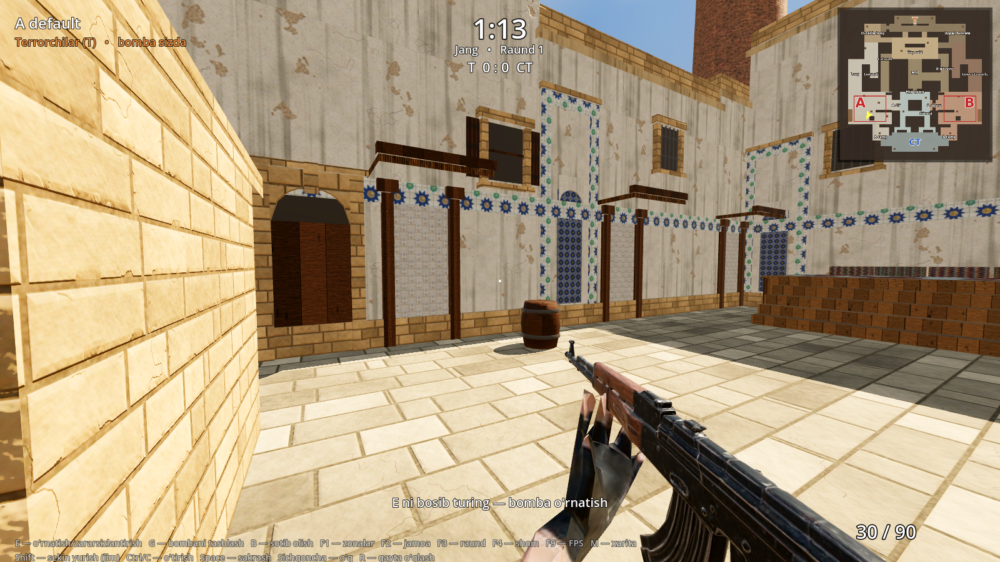
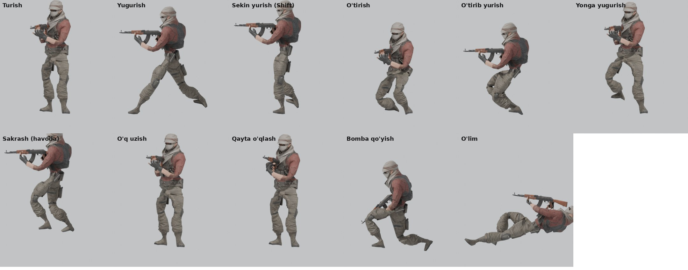
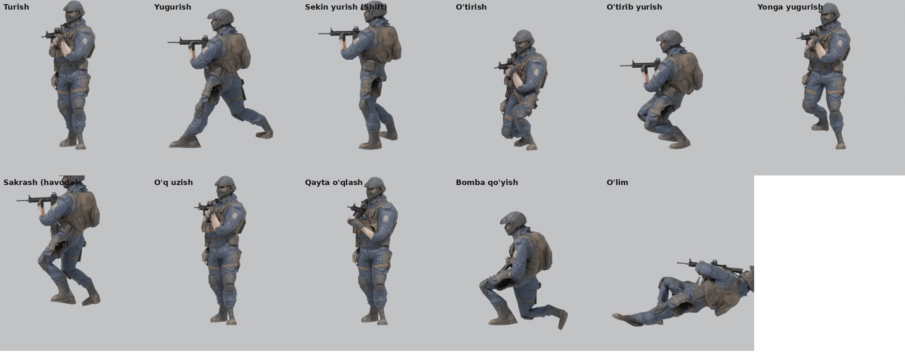
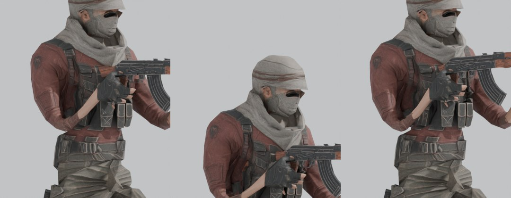
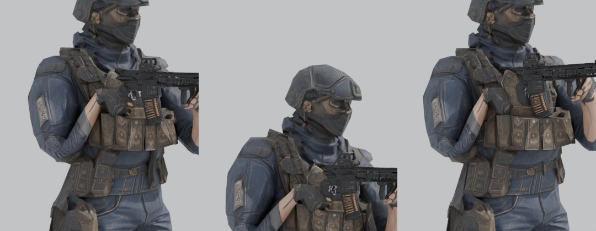
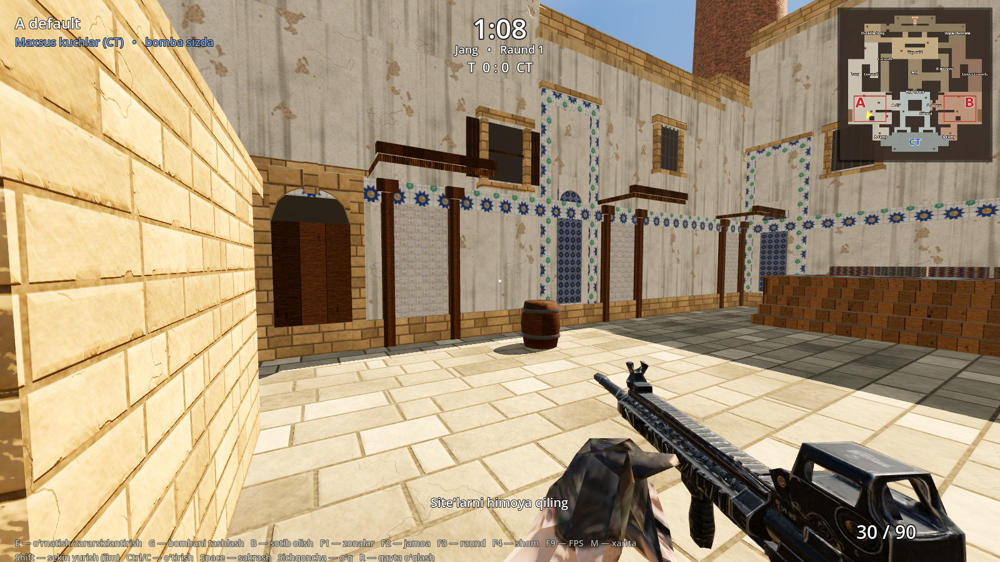
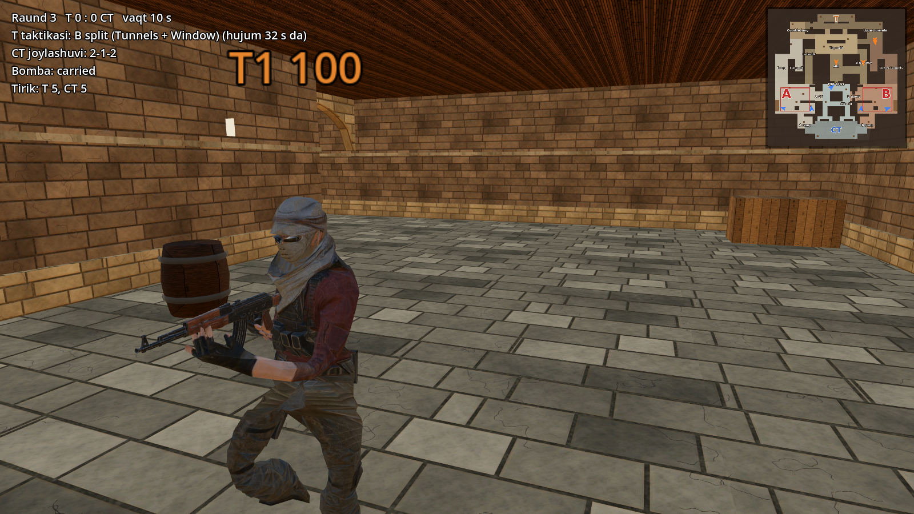
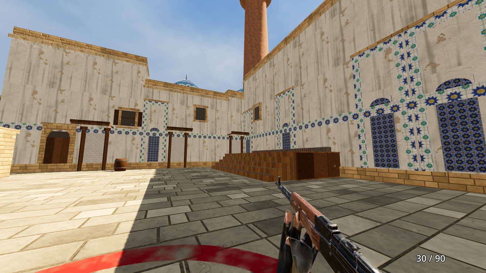
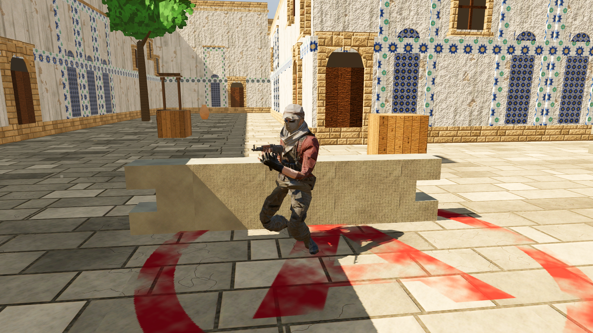

# 8-bosqich: yakuniy audit, realistik ko'rinish, personajlar va animatsiyalar

**Natija:**

- Xarita texnik jihatdan to'liq tekshirildi va topilgan nuqsonlar tuzatildi.
- Ko'rinish realistikroq qilindi: PBR teksturalar, bulutli osmon, eskirish izlari, qaytgan yorug'lik.
- T va CT personajlariga skelet va 21 ta animatsiya qo'shildi. Qurollar (AKM, M416) qo'lda tabiiy turadi.
- O'yinchiga oddiy yurish, sekin yurish (Shift, jim), o'tirish, o'tirib yurish va sakrash qo'shildi.
- Birinchi shaxsda qo'l va qurol ko'rinadi.

**Tekshiruvlar:**

| Tekshiruv | Natija |
|---|---|
| 2D tahlil | 59/59 |
| Godot | **116/116** |
| Smoke | 10/10 |
| Audit | **6/6** |
| Skrinshotlar | 24/24 |

## 1. Yakuniy audit (`godot/tests/run_audit.gd`)

Har bir yuriladigan katakdan (2 m to'r) haqiqiy fizika bilan tekshirildi:

| Tekshiruv | Qanday | Natija |
|---|---|---|
| Devorlardagi tirqish | Ko'z balandligidan 16 yo'nalishga nur yuborildi. Birortasi ham xaritadan tashqariga chiqmasligi kerak | Tirqish **0** |
| Tom teshiklari | Har bir yopiq yo'lak katagidan tepaga 3 ta nur | Teshik **0** |
| Yetib bo'lmaydigan joy | T spawn'dan har bir nuqtaga NavMesh yo'li | **0** |
| Tiqilib qolish | O'yinchi har bir callout hududiga ikkala spawn'dan fizika bilan yurib boradi | **0** |
| Xaritadan chiqish | 12 m dagi ko'rinmas qopqoq va chegara devorlari | ✅ |
| "Arvoh" bezak | To'qnashuvsiz past bezak (o'tib ketiladigan, lekin panaga o'xshaydigan narsa), `build5.py` | **0** |

**Topilgan va tuzatilgan xatolar:**

1. **NavMesh yopiq qutilar ichida va tomlarda "yuriladigan" joy ko'rsatgan.** Jami 232 + 30 poligon, yana 32 ta yakka orolcha bor edi. Bot yoki test maqsadi shunday joyga tushsa, yetib bo'lmasdi. `bake_nav.gd` endi ularni pishirgandan keyin olib tashlaydi: 753 ta toza poligon qoldi.
2. **`bots.tscn` NavMesh tayyor bo'lmasdan boshlanardi.** Birinchi soniyada xato chiqarardi, endi NavMesh sinxronlanishini kutadi.
3. **Fon tovushlari sahnadan chiqishda to'xtatilmasdi.** Endi to'xtatiladi.
4. **CT bot mantig'ini kuchaytirish sinab ko'rildi, lekin natija yomonlashdi.**
   - O'zgartirilgan qoidalar: tezroq aylanish va qaytarib olishdan oldin to'planish.
   - Ikki sinovda (720 raund) T g'alabasi 56–62% ga ko'tarildi, A/B farqi 8–12 foizga yetdi.
   - Shu sababli 7-bosqich mantig'i qaytarildi. Yakuniy natija pastdagi bo'limda.

## 2. Realistik ko'rinish

| | Oldin | Endi |
|---|---|---|
| Teksturalar | 512 px, faqat rang va normal | **1024 px PBR, 28 material.** Rang, normal va ORM (AO, g'adir-budurlik, metall). Tosh, g'isht, yo'lak toshi va ganchda relyef (parallax) bor. Godot uchun VRAM siqish (`materials.gd`, `textures_hq.py`) |
| Osmon | Protsedural gradient | Bulutli panorama, quyosh atrofida nur. Atrof yorug'ligi osmondan tushadi |
| Yorug'lik | SSAO, SSIL | + **SDFGI** (quyosh nurining devor va poldan qaytishi), **SSR** (koshinlarda aks), yumshoq soyalar, FXAA + MSAA 2×, debanding |
| Eskirish | Yo'q | **558 ta decal:** devor tagidagi kir, tom qirrasidan tushgan yomg'ir izlari, yoriqlar, poldagi dog'lar. Hammasi 25–40 m dan uzoqda so'nadi |

**Muhim cheklov:** decal'lar, SDFGI va SSR faqat **Forward+** renderda ishlaydi, ya'ni o'yinning odatiy rejimida (videokartali kompyuterda).
Bu serverda videokarta yo'q, skrinshotlar Compatibility renderda olingan. Shuning uchun ular bu effektlarsiz.
Haqiqiy ko'rinishni o'zingizning kompyuteringizda F5 bilan ko'rasiz.

**Fotosurat teksturalar:**

- Server tarmoq siyosati tashqi tekstura saytlarini yopgan, shuning uchun hammasi protsedural.
- Almashtirish oson: `godot/textures/<nom>_albedo.jpg` (hamda `_normal`, `_orm`) ni fotosurat asosidagisiga almashtiring.
- Kod o'zgarmaydi: `materials.gd` materialni nomi bo'yicha oladi.

**Balans o'zgarmadi:**

- To'qnashuv, panalar va NavMesh'ga hech narsa qo'shilmadi. Decal va materiallar faqat ko'rinishni o'zgartiradi.
- `build5.py` buni har safar tekshiradi (986 to'qnashuv qutisi).

## 3. Personajlar va qurollar

Siz yuborgan 4 ta Meshy modeli ishlatildi:

| | T: sahro operatori | CT: maxsus kuchlar |
|---|---|---|
| Qurol | AKM (0.88 m) | M416 (0.80 m) |
| Chap qo'l | Yog'och old dastaning ostida | Vertikal tutqichda |

`tools/rig_characters.py` (Blender) har bir personajga quyidagilarni avtomatik bajaradi:

1. **O'lchamni to'g'rilaydi:** bo'y 1.80 m (o'yinchi kapsulasi bilan bir xil), qurollar haqiqiy uzunlikda.
2. **Skelet:** 29 suyak.
   - Son va 3 umurtqa, ko'krak, bo'yin, bosh.
   - Qo'l tomoni: o'mrov, yelka, bilak, kaft, barmoqlar.
   - Oyoq tomoni: son, boldir, oyoq, barmoq.
   - Qurol va magazin suyaklari.
   - Bo'g'im nuqtalari modelning shaklidan o'lchab topiladi (oraliq, tizza, yelka, bilak).
3. **Og'irliklar (skinning):**
   - Masofaga qarab beriladi va tomon cheklovlari qo'llanadi: chap oyoq o'ng suyakka ergashmaydi, qo'l tanaga yopishmaydi.
   - Keyin mesh bo'ylab silliqlanadi. Har uchga ko'pi bilan 4 ta suyak.
4. **Qurol ushlash (IK):**
   - Qurolda ikki nuqta bor: to'pponcha dastasi (o'ng qo'l) va old dasta (chap qo'l).
   - Qo'llar shu nuqtalarga IK bilan yopishadi, kaftning yo'nalishi ham belgilanadi.
   - Barmoqlar dasta atrofida bukiladi (o'ng 72°, chap 58°).
   - Qo'ndoq o'ng yelka chuqurchasida turadi, tana 32° burilgan (chap yelka oldinda), bosh nishonga qaraydi.
   - Tana egilsa ham (o'tirish, yugurish) qurol og'zi doim oldinga qaraydi.
5. **Oyoqlar (IK):** tayanch fazasida oyoq yerda sirpanmasdan turadi, siltanishda ko'tariladi. Yonga yurganda oyoqlar biri oldidan, biri orqadan o'tadi, bir-biriga kirmaydi.
6. **Pishirish:** IK kalit kadrlarga "pishiriladi". Godot'da IK kerak emas: animatsiya aynan Blender'dagidek va yengil ishlaydi.

### Animatsiyalar (21 ta, 30 kadr/s)

| Guruh | Animatsiyalar | Izoh |
|---|---|---|
| Turish | `idle`, `crouch_idle` | Nafas olish, qurol sal tebranadi |
| Oddiy harakat (4.5 m/s) | `run_f/b/l/r` | 4 yo'nalish. **Qadam tovushi eshitiladi** |
| Sekin yurish (**Shift**, 2.3 m/s) | `walk_f/b/l/r` | **Qadam tovushi yo'q** |
| O'tirib yurish (**Ctrl** yoki **C**, 1.55 m/s) | `crouch_f/b/l/r` | **Qadam tovushi yo'q**, bo'y 1.25 m |
| Sakrash | `jump_start`, `jump_air`, `jump_land` | Qo'nishda tovush bor |
| Qurol | `fire`, `reload` | Faqat tananing yuqori qismi: yugurib yoki o'tirib otsa ham oyoqlar buzilmaydi. Qayta o'qlashda magazin qo'l bilan chiqadi, kamardan yangisi olinadi (2.7 s) |
| Boshqa | `plant`, `death` | Tiz cho'kib bomba qo'yish yoki zararsizlantirish; orqaga yiqilish |

Hamma yurishlar bir xil siklda (0.6 s). Shu sababli sekin yurish ↔ yugurish ↔ o'tirish silliq aralashadi va qadamlar mos tushadi.

**Qurol ushlash (yaqindan):**

### Godot'da

- **`character_model.gd`** — personaj, AnimationTree kodda quriladi:
  - turish/yurish/yugurish (BlendSpace2D, 4 yo'nalish);
  - o'tirish (BlendSpace2D);
  - havoda bo'lish, qo'nish va sakrash (OneShot);
  - bomba qo'yish;
  - o'q uzish va qayta o'qlash: tananing yuqori qismi, suyak filtri bilan;
  - o'lim.
- **O'yinchi (`player.gd`):**
  - Oddiy harakat 4.5 m/s, qadam eshitiladi.
  - **Shift** — 2.3 m/s, jim.
  - **Ctrl/C** — o'tirish: 1.55 m/s, jim; kapsula 1.8 → 1.25 m, ko'z 1.65 → 1.08 m.
  - Ustida past tom bo'lsa, turib bo'lmaydi.
  - **Space** — sakrash, qo'nishda tovush bor.
- **Birinchi shaxs (`fp_view.gd`):**
  - Kamerada qo'llar va qurol ko'rinadi: CS'dagidek o'ng pastda, o'sha animatsiyalar bilan.
  - Model 0.6× kichraytirilib kameraga yaqinlashtirilgan: ko'rinishi o'sha-o'sha, lekin devorga kirib ketmaydi.
  - **Sichqoncha** — avtomatik o'q (600/daqiqa), tepki va chaqnash bor.
  - **R** — qayta o'qlash (30/90).
  - F2 bilan jamoa almashsa, qurol ham almashadi (AKM ↔ M416).
- **Botlar (`bots.tscn`):**
  - Kapsulalar o'rniga shu personajlar ishlatiladi. Harakatdan animatsiya o'zi tanlanadi, otganda tepki animatsiyasi va 3D o'q ovozi bor.
  - Qadam tovushlari 3D da eshitiladi.
  - O'lganda yiqiladi va raund oxirigacha yotadi.

### O'yinchi: o'ziga 1-shaxs, boshqalarga 3-shaxs

Bu render qatlamlari bilan ajratilgan:

| Kim ko'radi | Nima ko'rinadi |
|---|---|
| **O'yinchining o'z kamerasi** | Faqat qo'llar va qurol (12-qatlam, `Camera3D/FPView`). O'z tanasi ko'rinmaydi (11-qatlam kamera maskasidan chiqarilgan), lekin **soyasi yerda ko'rinadi** (CS2 dagidek) |
| **Boshqa har qanday kamera:** tomoshabin, boshqa o'yinchi, bot kamerasi, skrinshot | To'liq tana (`Body`) qo'ldagi qurol bilan, xuddi botlardek |

**Ikkinchi ro'yxatning 1-shaxs qo'llari boshqa kamerada yashiriladi.** Havoda uchib yurgan qo'l ko'rinmaydi.

3-shaxs tana o'yinchiga ergashadi:

- **Yurish:** oddiy yugurish, sekin yurish (Shift) va 4 yo'nalish animatsiyalari.
- **Holat:** o'tirish, sakrash va qo'nish, bomba qo'yish.
- **Qurol:** otganda tepki, R bosilganda qayta o'qlash animatsiyasi.
- **Nishon:** tepaga yoki pastga qarasa, tananing yuqori qismi shu tomonga egiladi (umurtqa 40%, ko'krak 60%). Boshqalar qurolingiz qayerga qaraganini ko'radi.

O'yinchi alohida sahnaga ajratildi: **`scenes/player.tscn`**.

- **Bizning o'yinchi:** `local_player = true` — 1-shaxs + boshqalarga 3-shaxs.
- **Masofaviy (tarmoqdagi) o'yinchi:** `local_player = false`.
  - 1-shaxs qo'llari va klaviatura yo'q, faqat 3-shaxs tana.
  - Uning tanasi hamma kameraga, shu jumladan bizning kameramizga ham ko'rinadi.
  - Tarmoq o'yini qo'shilganda boshqa o'yinchilar shu sahnadan yaratiladi.

**19-bo'lim testlari (5 ta):**

- O'z kamerasi o'z tanasini ko'rmaydi, tana esa soya tashlaydi.
- O'z kamerasida 1-shaxs ko'rinadi.
- Boshqa kamerada 3-shaxs ko'rinadi, 1-shaxs qo'llari yo'q.
- Tana o'tirish, yurish va nishon burchagiga ergashadi (0.6 rad qarashda 35°).
- Masofaviy o'yinchi to'g'ri ko'rinadi.

### Avtomatik tekshiruvlar (`run_tests.gd`, 18-bo'lim)

- Ikkala personajda 21 animatsiya, 29 suyak va qo'ldagi qurol bor.
- 9 ta animatsiyaning har birida 6 ta kadr tekshiriladi: **ikkala kaft qurol dastasidan 2 sm dan ko'p siljimaydi.**
- Turganda va o'tirganda oyoqlar yerda (to'piq 5–12 sm).
- Oddiy harakat 4.5 m/s, 1.5 s da 3 va undan ko'p qadam tovushi.
- Shift: 2.3 m/s, 0 qadam tovushi.
- O'tirish: 1.55 m/s, 0 qadam tovushi, bo'y 1.25 m, ko'z 1.08 m.
- Tugma qo'yib yuborilganda qad tiklanadi. Sakrab qo'nganda tovush chiqadi.
- Birinchi shaxsda qurol bor, o'q uzganda o'q kamayadi va tepki animatsiyasi o'ynaydi.

**Cheklovlar (halol):**

1. **Modellar yengil (≈3 ming uchburchak).**
   - Meshy modellarida barmoqlar alohida emas, shuning uchun har qo'lda bitta "barmoqlar" suyagi bor: kaft yumiladi, lekin har barmoq alohida bukilmaydi.
   - Yuz animatsiyasi yo'q.
2. **Animatsiyalar kod bilan yozilgan, harakatni yozib olish (mocap) emas.** Ular aniq va bir xil, lekin professional mocap'dek jonli emas. Mixamo yoki mocap animatsiyasini xuddi shu skeletga qo'yish mumkin.
3. **O'yinchining o'qi faqat ko'rinish va tovush.** Hozircha o'yinchi otganda zarar berish tizimi yo'q, u keyingi ish. Botlarning o'z jang modeli bor.

## 4. Yakuniy bot sinovi (360 raund, seed 3)

| | 7-bosqich | 8-bosqich (yakuniy) |
|---|---|---|
| T umumiy | 55.6% | 60.6% |
| T, A site'ga | 58.8% | 61.9% |
| T, B site'ga | 53.0% | 59.5% |
| **A va B farqi** | 5.8 foiz | **2.4 foiz** ✅ (maqsad ≤ 10) |
| Bomba o'rnatildi | 85.0% | 84.4% |
| Qaytarib olish | 40.5% | 32.6% |

- **Site balansi yaxshilandi.** A va B deyarli teng.
- **T umumiy g'alabasi 45–55% maqsaddan yuqori.**
  - Sababi: NavMesh tozalangach, botlarning yo'llari o'zgardi. Xarita (devorlar, panalar, masofalar) o'zgarmadi.
  - CT botlar sust aylanadi va qaytarib olishda yakkama-yakka kiradi.
  - Buni tuzatishga urinish bo'ldi (1-bo'lim, 4-band), lekin ahvol yomonlashdi va u qaytarildi.
  - Bu bot mantig'i masalasi. Haqiqiy o'yinchilar bilan tekshirish kerak.
- **Batafsil:** `bots_final_stage8.txt` va `bots_final_stage8.json`.
